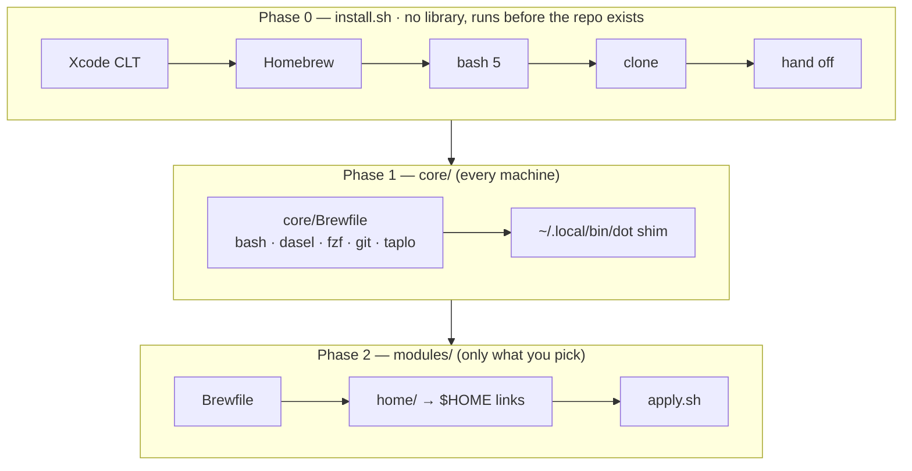
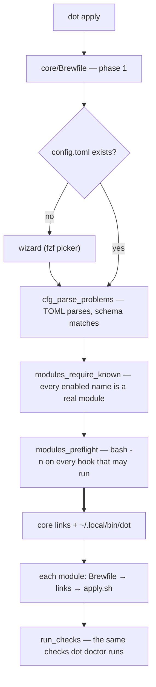
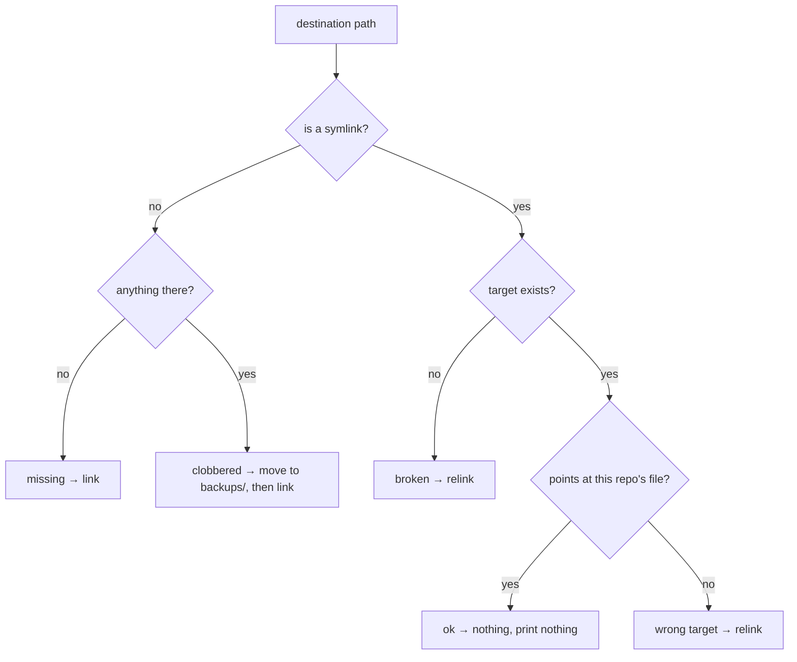
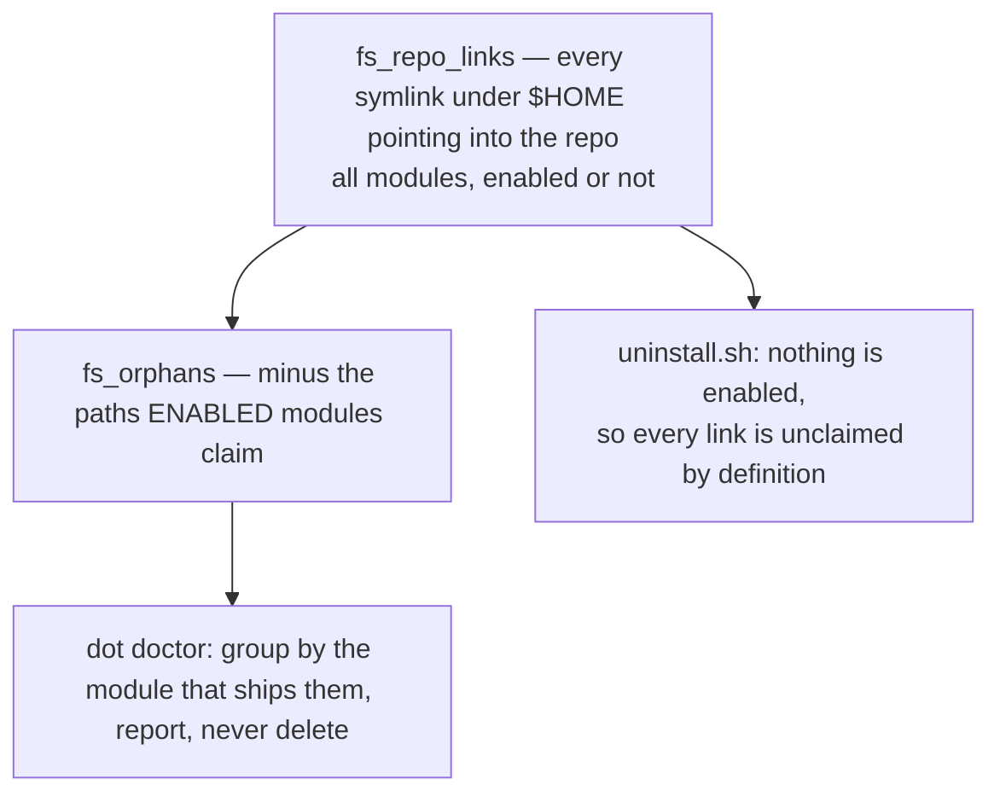

# dotfiles

macOS setup: Homebrew, packages, and config files. One command on a fresh Mac.

[](https://github.com/martinzachariassen/dotfiles/actions/workflows/ci.yml)

```sh
curl -fsSL https://raw.githubusercontent.com/martinzachariassen/dotfiles/main/install.sh | bash
```

[How it works](#how-it-works) · [Commands](#commands) ·
[Core concepts](#core-concepts) · [Configuration](#configuration) ·
[Modules](#modules) · [Uninstalling](#uninstalling) ·
[Development](#development) · [SSH and commit signing](#ssh-and-commit-signing)

## How it works

Three phases. The order is load-bearing: each installs the tools the next one
assumes.



Phase 1 is why the first-run picker can be one `fzf` call, and why `config.toml`
is read by a real TOML parser. Within a module the order is fixed — **Brewfile →
links → `apply.sh`** — so `apply.sh` may always assume its packages and config
files are in place.

## Commands

```
dot apply              Install packages, link configs, run module hooks
dot apply --dry-run    Show every intended change, make none
dot add <module>       Enable one module and apply it
dot remove <module>    Undo one module and disable it
dot config             Open the config file in $EDITOR
dot config --init      Create it for the first time (runs the picker)
dot doctor             Check this machine; read-only
```

`add` and `remove` take `--dry-run` too. Re-running `dot apply` is safe and
expected; it is also the update path:

```sh
git -C ~/Developer/personal/dotfiles pull && dot apply
```

It updates the *configuration*, not the packages. `apply` runs `brew bundle
--no-upgrade`, so a package a Brewfile gained arrives and a newer version of one
you have does not — a `dot apply` you ran to relink one file should not move your
toolchain underneath you. Upgrading is `brew upgrade`, on your schedule.

Exit status is derived from tallies, never propagated by hand: `0` clean, `1` if
anything failed, `3` from a *hook* that only warned. Warnings never change the
status at the top level, so `dot doctor && …` survives an orphaned link.

`apply`, `add` and `remove` each keep a transcript and say where at the end —
`~/.local/state/dotfiles/logs/<timestamp>-<verb>.log`, one file per run, twenty
kept for the directory. `config` hands the terminal to your editor and `doctor`
changes nothing, so neither writes one.

Removing it *all* again is [`uninstall.sh`](#uninstalling), not a verb of its
own.

## Core concepts

### The module contract

A module is a directory. **The directory listing is the registry** — there is no
central list to update, because a central list can disagree with the filesystem.
`tests/contract.bats` walks the same glob the driver walks, which is what makes
that safe.

```
modules/<name>/
├── module.toml     required   description (the only field)
├── Brewfile        optional   packages for this module
├── home/           optional   mirrors $HOME literally; leaf files are symlinked
├── data/           optional   module-private; its own hooks read it, nothing links it
├── apply.sh        optional   imperative, idempotent, run in its own process
├── doctor.sh       optional   read-only checks
├── remove.sh       optional   cleanup the uninstaller cannot derive
└── README.md       optional
```

Those names are the whole vocabulary — `contract.bats` fails on anything else,
because a config file one level too high looks installed and is inert. Hooks are
**executed, never sourced**, so `bash modules/git/doctor.sh` is exactly what the
driver does. Adding a module is creating the directory and writing the one line
of `module.toml`.

### Nothing writes before everything has been read



Everything above the thick arrow only reads. `modules_preflight` is the last
gate: a syntax error in `modules/x/apply.sh` must not surface halfway through an
apply that has already relinked. And an apply ends by *observing* the machine
rather than reporting what it attempted — that tail is `dot doctor`'s own code,
safe there because `contract.bats` proves no `doctor.sh` writes to `$HOME`.

### The link engine

Leaf files under a module's `home/` are **symlinked** into `$HOME` at the same
relative path, so editing `~/.config/git/config` edits the file in the repo.



Two rules, and a bug in either loses files:

- **Directories are never symlinked, only traversed.** If `~/.config` were a link
  into the repo, one module would own the whole tree and every other tool's files
  would vanish.
- **A real file in the way is moved, never overwritten** — to
  `~/.local/state/dotfiles/backups/<timestamp>/`. After a collision it exists in
  exactly one place. A real *directory* is moved the same way, whole, and both
  `apply` and `doctor` say "directory" rather than "file" so the report matches
  the size of what just happened.

The same classifier drives linking and the drift report, so `dot doctor` names
these states in the words you will actually see — `not linked`, `wrong target`,
`real file`, `real directory`, `broken link`. It reports them; it never deletes
anything in your home directory on its own.

### Derive, never record

There is no state file. What is installed is worked out by looking, so it cannot
go stale — and uninstall becomes a special case of a scan that already existed:



The scan is bounded rather than a walk of your whole home directory: every
directory on the path to a file some module ships, and one level past each. That
extra level catches a directory the repo *stopped* shipping into — rename a
skill and the link left behind is still found. The boundary is pinned in
`tests/orphans.bats`.

Orphans are grouped by the module that ships them, because the two causes need
opposite advice. A path the repo no longer ships is finished by the `rm`. A
module you switched off is not: `rm` would leave you believing the machine was
clean while its `defaults`, generated files and links outside the repo are all
still there. So the report names the module and its `remove.sh` — or says
outright that the module leaves nothing else behind.

A module therefore only needs a `remove.sh` for what the sweep structurally
cannot see. The four kinds are documented in
[`modules/CLAUDE.md`](modules/CLAUDE.md).

### Your files stay yours

**Nothing here deletes a real file.** Symlinks and provably-generated files only,
and the backup tree is never removed.

Where the repo must touch a file you own, it does so key-by-key and gives it back
the same way. `~/.claude/settings.json` is merged into with `jq`, and only the
leaves still holding exactly what was written are ever taken back. `config.toml`
is the same trade: `dot add` and `dot remove` splice one line into one array and
copy every other byte through, comments and spacing included.

The proof is the array's shape. `dot config --init` writes one `"name",` per
line, and that is the only shape these will edit. Reformat it by hand —
`enabled = ["git", "zsh"]` — and they refuse and tell you to edit it yourself,
rather than rewrite a file they can no longer claim to understand. Hand-editing
is a supported workflow; being reformatted behind your back is not.

### Dry run and real run print the same words

`--dry-run` is not a hand-written summary: it is the real code path with every
mutating helper turned into a `printf`, so it cannot disagree with the real run.
Intent is announced before acting. `contract.bats` snapshots `$HOME` around every
`apply.sh` and every `remove.sh` to hold this.

## Configuration

`~/.config/dotfiles/config.toml` is the only source of truth. It is generated
**once**, by `dot config --init`, and belongs to you from that moment on.

```toml
schema = 1

[modules]
enabled = [
  "git",
  "zsh",
]

[settings.git]
signingkey = "ssh-ed25519 AAAA..."
```

Then `dot apply`. Editing it by hand is supported, so a mistake has to be an
error rather than a run reporting success having installed three modules of four:

- **A name with no matching module** stops the run and prints the real ones.
- **A file that does not parse whole** stops it too. `dasel` reads TOML but does
  not validate it — on a malformed line it stops, keeps what it read and exits
  `0`, silently dropping the rest of the file. So `taplo` is asked first, with
  two heuristics behind it for the machine where phase 1 has not run yet.
- **`schema` must be one this checkout speaks.** Checked, not merely written: a
  version marker that guarantees nothing is worse than none, because it looks
  like a check.

Per-module settings live under `[settings.<module>]`; a module reads its own with
`module_setting` and ignores anything it does not recognise.

### Enabling and disabling

```sh
dot add containers --dry-run    # the whole plan, nothing changed
dot add containers              # into the list, then packages, links, apply.sh
dot remove containers           # remove.sh, then unlink, then out of the list
```

`remove` runs in the order `uninstall.sh` uses, and the config write comes last
on purpose — it is the commit point, so anything that failed above it leaves the
module still listed and re-running is the fix.

**Packages stay.** `remove` says so on every run, because "removed" reads as if
they went too. Uninstalling them is `brew uninstall`, and it stays yours —
nothing here can tell which of them you also wanted for something else.

Editing `enabled` by hand instead is still supported, and still leaves things
behind, because nothing then runs the module's `remove.sh`. That is what `dot
doctor`'s orphan report is for; it prints the command to finish the job:

```sh
DOT_ROOT=$PWD DOT_DRY_RUN=1 bash modules/containers/remove.sh   # preview
DOT_ROOT=$PWD bash modules/containers/remove.sh                 # do it
```

`DOT_ROOT` has to be set: every hook sources the library through it.

One thing no route can undo: **[`macos-defaults`](modules/macos-defaults/README.md)
cannot be put back.**

### Profiles

`dot config --init` offers the profiles in `profiles.toml` as starting points for
the checklist, plus **`none`**, which skips the picker and writes an empty list.
There is no "custom" profile — hand-assembling a module list is what the config
file is for. Profiles are a first-run convenience only; `dot apply` never reads
`profiles.toml`.

`profiles.toml` also carries a `[user]` table — name, email, and the public half
of the SSH key that signs commits. **The wizard copies these into `config.toml`
and never asks for them**, because none of the three varies by machine, and a
prompt whose answer is always the same is ceremony. The signing key is safe in a
public repo by construction: it is a *public* key, the kind GitHub already serves
at `github.com/<user>.keys`.

## Modules

Every module is the same shape to the driver, but what *enabling* one means to
you splits in two.

**Tool modules** manage a tool's configuration, and install the tool as well —
config and package are never split across two modules, so a module is never
half-enabled.

| Tool module | What it manages |
|---|---|
| `git` | [config, aliases, and a generated machine-local include](modules/git/README.md) |
| `ssh` | client config; keys stay in 1Password's agent |
| `zsh` | XDG layout, aliases, PATH, `$EDITOR`, starship |
| `cmux` | the terminal, plus the Ghostty config it reads: Option stays native for Æ/Ø/Å |
| `claude-code` | [the CLI, and keys merged into `~/.claude/settings.json`](modules/claude-code/README.md) |
| `containers` | [Docker via colima](modules/containers/README.md), no Docker Desktop |
| `dev-cli` | [CLI tools and mise-managed language runtimes](modules/dev-cli/README.md) |
| `macos-defaults` | [Dock, Finder, keyboard, screenshots](modules/macos-defaults/README.md) — imperative, no files at all |

**Package sets** are a Brewfile and nothing else: a shopping list for tools this
repo installs but does not configure. `dot apply` labels them `packages only` as
it goes. A tool here that grows a config file leaves for a module of its own.

| Package set | What it installs |
|---|---|
| `apps` | GUI casks and fonts: 1Password, Raycast, VS Code, … |
| `work-apps` | what an employer's machine needs: Intune, Office, Teams, Slack |
| `dotfiles-dev` | the toolchain `make check` runs, for a machine you develop *this repo* on |

`dotfiles-dev` is the odd one: the other two are software you use, and it is
software the repo's own tests need. It is here rather than in `core/Brewfile`
because a machine that merely *uses* the dotfiles should not carry a linter.

The split is descriptive, not enforced — the shapes are identical to the driver
and differ only to the reader — so it is only true while the directory says so. A
module can cross the line by growing, and the honest move is then to relabel it.

## Uninstalling

```sh
bash uninstall.sh --dry-run    # print every intended change, make none
bash uninstall.sh              # do it
```

The counterpart to `install.sh` rather than a sixth `dot` verb: `bin/dot` is
capped at five, and the most destructive thing the repo can do does not belong
behind the command you type every day. The interactive run shows you the
`--dry-run` preview and then asks you to type `remove`.

A full reset — module `remove.sh` hooks, links, generated files, config, logs,
applications, Homebrew, and finally the checkout. **Xcode Command Line Tools are
left installed**, being macOS developer plumbing rather than something this repo
chose for you.

**Homebrew goes in its entirety, not just the packages this repo named.** Its
uninstaller removes the whole Cellar and Caskroom and keeps no record of who
asked for what. The preview counts this out rather than describing it, because
the sentence version reads as "the packages this repo installed" and that is the
one misreading that matters:

```
Homebrew and the repo
  → uninstall Homebrew and all 85 formulae it manages
  ! 59 of those are named by no Brewfile here -- they go too
  → remove  /Users/you/Developer/personal/dotfiles
```

**Casks are removed first, by name, while Homebrew still works.** Homebrew
*moves* a cask's `.app` into `/Applications`, and its own uninstaller deletes the
prefix and nothing outside it — left to itself it would strand every GUI app on
the machine, still installed with nothing left that can remove them. `brew
services` leaks the same way, so services are stopped first. Each cask goes with
`--zap`. If one *fails*, the run stops before Homebrew: destroying the only tool
that could remove an app you just failed to remove is exactly the leftover this
step prevents.

Three things it will not do:

- **It never deletes your backup tree.** `~/.local/state/dotfiles/backups/` holds
  real files an earlier `apply` moved aside, and nothing else has a copy.
- **It never deletes a real file it did not put there.** Symlinks into the repo,
  the two generated files it can prove it wrote, and the paths that are the
  repo's own by definition. The directories then go with `rmdir`, not `rm -rf`,
  so a file some other tool left keeps it alive and gets reported.
- **It cannot undo macOS defaults.** It reports the domains instead — and only
  when at least one is still in force, because it runs every module's
  `remove.sh`, enabled or not, and a machine that never turned this one on must
  not be told its preferences were changed.

## Templating

There isn't any, and that is a decision. Machine-local values go through the
tool's own include mechanism — `~/.config/git/config.local`, generated by
`modules/git/apply.sh`, and `~/.config/zsh/local.zsh`, sourced if present and
never tracked. If a generator ever needs a conditional, the conditional belongs
in the tool's own config language, not in bash.

## Development

```sh
make check     # shellcheck, shfmt, bats
```

That is the whole list, and exactly what CI runs — the commands live in the
`Makefile` and nowhere else. Individually: `make lint`, `make fmt` (rewrites
files), `make test`. The tools are deliberately **not** in `core/Brewfile`, which
is machinery only; they are the `dotfiles-dev` module, and its Brewfile stands
alone:

```sh
brew bundle --file modules/dotfiles-dev/Brewfile
```

`make brew-audit` and the `install-smoke` workflow are separate on purpose: both
need the network and change verdict for reasons outside any one pull request, so
neither may fail a PR about something else. They run on a schedule, and on the
pull requests where the answer is the thing under review.

There is no line budget. What CI enforces is *shape*, in `tests/contract.bats`:

| What | Limit |
|---|---|
| `lib/` | 7 files, no subdirectories |
| `bin/dot` | 5 verbs, hardcoded `case` |
| `module.toml` | 1 field: `description` |
| Module hooks | `apply.sh`, `doctor.sh`, `remove.sh` — closed set |
| Module dirs | `home/` (linked), `data/` (hook-private) — closed set |

Each is a thing the driver reads, so widening one changes what the repo *is*, and
each means editing `contract.bats` to do it. That friction is the point.
`contract.bats` also holds the cross-file invariants, including two about this
file: it fails if a module goes unmentioned here, or if a verb is missing from
the list above. Design rules per directory live in the `CLAUDE.md` files
([`lib/`](lib/CLAUDE.md) · [`bin/`](bin/CLAUDE.md) · [`core/`](core/CLAUDE.md) ·
[`modules/`](modules/CLAUDE.md) · [`tests/`](tests/CLAUDE.md)).

### When something breaks

A crash prints one line — file, line, command, status — whether it happened in
`dot` or inside a module hook run as its own process:

```
✗ modules/macos-defaults/apply.sh:24: defaults write com.apple.dock autohide -bool true (exit 1)
```

When one line is not enough, hooks are ordinary scripts: `bash -x
modules/git/apply.sh`.

### Bash 5

macOS still ships 3.2.57 from 2007 as `/bin/bash` and never updates it, so
`install.sh` runs `brew install bash` before anything else in the repo starts,
`core/Brewfile` keeps it managed, `bin/dot` and `uninstall.sh` re-exec themselves
into it, and `lib/dot.sh` refuses outright. Five places, held together by
`contract.bats`.

One Homebrew package in exchange for associative arrays, `mapfile`, and — the
reason it was worth doing — correct line numbers in the crash report above. Bash
3.2 names a function's *definition* line rather than the failing one.

## SSH and commit signing

There are no private keys on this machine. 1Password holds them and exposes an
agent socket; `ssh` asks that agent to sign, and the key never leaves the vault.
`modules/ssh` is the one line of config that points at it:

```
Host *
  IdentityAgent "~/Library/Group Containers/2BUA8C4S2C.com.1password/t/agent.sock"
```

That path is the same on every Mac — `2BUA8C4S2C` is AgileBits' Apple team ID,
not something per-user — which is why it can be tracked rather than generated.
The machine-local override `~/.ssh/config.local` is `Include`d **first**, so
anything in it wins: ssh takes the first value it obtains for each keyword.

Commit signing rides on the same agent and is set up by
[`modules/git`](modules/git/README.md).

One step cannot be automated: **1Password → Settings → Developer → "Use the SSH
agent"**. Until it is ticked the socket does not exist, and the failure never
mentions SSH config — `git push` reports `Permission denied (publickey)`, which
reads as a key problem and sends you hunting through a key directory that is
empty on purpose. `modules/ssh/doctor.sh` checks the socket, so `dot doctor` says
so plainly instead.

## License

[MIT](LICENSE).
