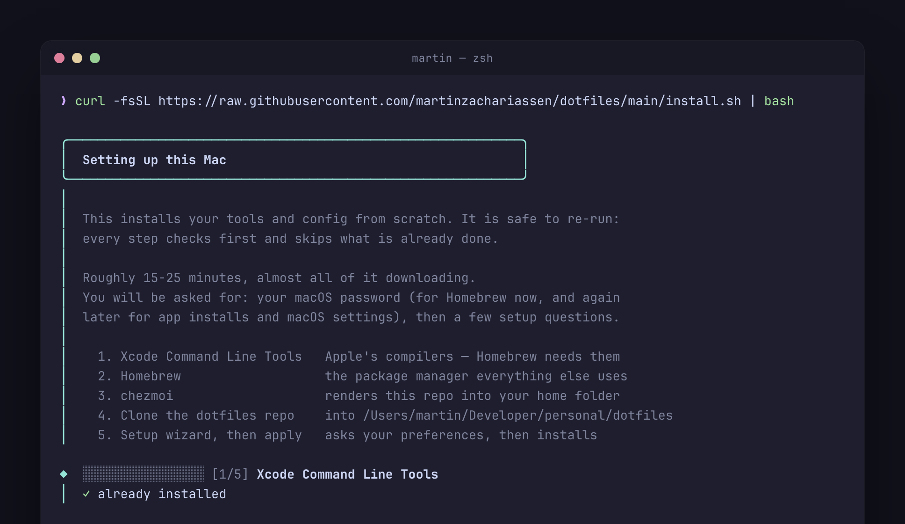
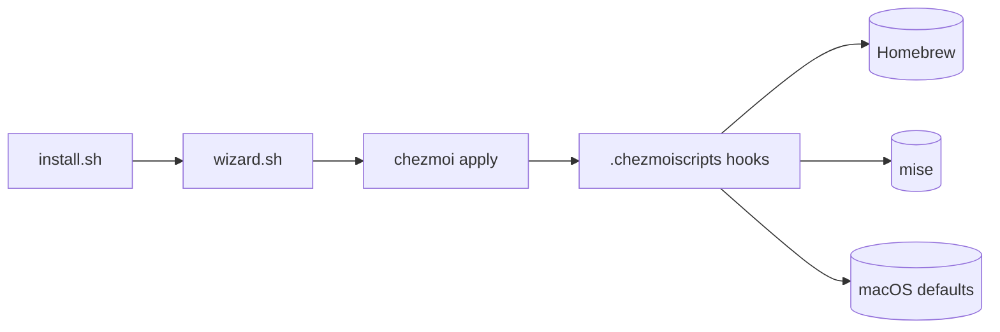

# dotfiles

One `curl | bash` turns a fresh Apple Silicon Mac into my backend workstation, managed by [chezmoi](https://chezmoi.io).

[](https://github.com/martinzachariassen/dotfiles/actions/workflows/ci.yml)
[](LICENSE)



**Status:** Personal, single-machine setup. Actively maintained, applied to my Mac most weeks.

## Why

- **One command, idempotent.** [`install.sh`](install.sh) takes a fresh or legacy Mac from zero — Xcode CLT → Homebrew → this repo → every package → macOS defaults — and every step is safe to re-run.
- **Convergent, not scripted.** `chezmoi apply` reconciles *real installed state* against the repo on every run, rather than replaying a one-shot setup script.
- **Additive by contract.** An apply only ever installs what the Brewfiles declare; it never uninstalls. Removal is a separate, confirm-gated verb (`chezmirror`/`chezclean`) you run by hand — see [docs/lifecycle.md](docs/lifecycle.md).
- **What this isn't.** A general-purpose dotfiles framework for arbitrary machines and users. It's tuned to one person's single Apple Silicon Mac; profiles and modules exist for my own personal/work split, not for broad customization. Fork it as a starting point, but expect to swap in your own packages, theme, and macOS defaults.

## Quickstart

```sh
curl -fsSL https://raw.githubusercontent.com/martinzachariassen/dotfiles/main/install.sh | bash
```

Works on both a fresh and an existing Mac — the installer snapshots any legacy dotfiles into a timestamped backup before taking over (`SKIP_BACKUP=1` to skip) and runs a [deprecation cleanup](docs/install.md#cleaning-up-drift-on-an-existing-mac). When the plain-text wizard finishes, sign in and reload:

```sh
open -a 1Password                                                  # skip if disabled
bash ~/Developer/personal/dotfiles/scripts/bin/bootstrap-auth.sh   # finishes git signing
exec zsh                                                           # reload the managed shell
chezdoctor                                                         # verify everything is healthy
sudo shutdown -r now                                               # reboot to finish macOS defaults
```

From then on, staying current is one verb:

```sh
chezup    # pull latest → preview the drift → apply
```

> [!NOTE]
> The wizard replaces chezmoi's own TUI picker, which is unreliable under `curl | bash`. It asks plain-text prompts, then feeds the answers to `chezmoi init --apply` as flags. Advanced flags (`DOTFILES_REPO`, `DOTFILES_DIR`, `--promptDefaults`) are in [docs/install.md](docs/install.md#advanced-flags).

## What you get

| Area | Baseline |
| --- | --- |
| Terminal | [Ghostty](https://ghostty.org), [Zellij](https://zellij.dev), [Starship](https://starship.rs), Catppuccin Mocha, JetBrainsMono Nerd Font |
| Shell | zsh with XDG layout, fzf, zoxide, Carapace completions, syntax highlighting, modern CLI aliases |
| Editors | VS Code via Homebrew (extensions in [`packages/vscode-extensions.txt`](packages/vscode-extensions.txt)), Neovim with LazyVim |
| Git | 1Password SSH signing, delta diffs, useful aliases, pull rebase, rerere |
| Runtimes | [mise](https://mise.jdx.dev) for per-project Java/Node/Python; global defaults in `~/.config/mise/config.toml` |
| iOS / Swift | Optional `appleDev` module: SwiftLint, SwiftFormat, [xcodes](https://github.com/XcodesOrg/xcodes), xcbeautify, fastlane, SF Symbols — [details](docs/packages.md#optional-modules) |
| AI | Default `macApps` module: the Claude and Claude Code apps |
| Apps | Homebrew-managed core apps, optional Mac app extras, profile-specific personal/work layers |
| macOS | Keyboard, Finder, Dock, screenshots, TextEdit, and security defaults — [full list](docs/macos.md) |

## Commands

Every `chez*` verb is a zsh function in [`src/dot_config/zsh/dot_zshrc.tmpl`](src/dot_config/zsh/dot_zshrc.tmpl) that delegates to a script in [`scripts/bin/`](scripts/bin). Two matter day to day; `chezhelp` prints the full list in your terminal.

| Command | What it does |
| --- | --- |
| `chezup` | **Converge this Mac to the repo.** Pull latest → preview the drift → apply. The one you run most. |
| `chezdoctor` | Read-only **health check**: repo, chezmoi, brew, auth, signing, mise, shell layout. Fixes nothing. |
| `chezsetup` | Re-run the setup wizard to change profile/modules (`--reset`/`-r`), or just fill in newly added setup keys (default). |
| `chezsign` | Set **only** the git signing key, keeping every other answer. For the fresh-Mac case where the key was still locked in 1Password when the wizard asked. |
| `chezapply` / `chezstatus` | Apply without pulling, or explain pending file + package drift in plain words. Both read the same `chezmoi status`. |
| `chezmirror` / `chezclean` | Confirm-gated **removal**: untracked Homebrew packages, and untracked dotfiles under `$HOME`/`~/.config`. An apply never uninstalls — this is the deliberate, manual undo. |
| `chezreconcile` / `chezbump` | Full package reconcile in one step (install + remove), or a routine `brew`/`mise` upgrade. |

Full reference, including `DRY_RUN=1`/`YES=1` flags and what each verb touches: [docs/commands.md](docs/commands.md).

## Architecture

`install.sh` is a tiny bootstrap fetched via `curl | bash` **before the repo exists on disk** — it installs only the prerequisites, then hands off to the setup wizard, which feeds your answers to `chezmoi init --apply`. `chezup` runs the same `chezmoi apply` on every subsequent run, which is what makes the whole system convergent rather than a one-shot script.



The repo root splits into **what chezmoi deploys** (everything under `src/`, its source directory per [`.chezmoiroot`](.chezmoiroot)) and **the tooling that supports it** (everything else — `scripts/`, `packages/`, `tests/`, `docs/`, `install.sh`, never rendered to `$HOME`). Full layout, naming conventions, and the hook stage-by-stage breakdown: [docs/architecture.md](docs/architecture.md) and [docs/lifecycle.md](docs/lifecycle.md).

## Documentation

Deeper guides live in [`docs/`](docs/) ([index](docs/README.md)):

| Doc | Covers |
| --- | --- |
| [install.md](docs/install.md) | Bootstrap scenarios, `install.sh` flags, deprecation cleanup |
| [commands.md](docs/commands.md) | Every verb — `chezup`, `chezdoctor`, and the occasional helpers |
| [packages.md](docs/packages.md) | Package tiers, profiles, the module catalog, and the wizard |
| [architecture.md](docs/architecture.md) | The `src/` split, repo layout, and `scripts/` organization |
| [lifecycle.md](docs/lifecycle.md) | What `chezmoi apply` does, stage by stage |
| [macos.md](docs/macos.md) | Every macOS system setting applied |
| [development.md](docs/development.md) | Quality gates, the CI matrix, and the bats suites |
| [shell.md](docs/shell.md) · [terminal.md](docs/terminal.md) · [editors.md](docs/editors.md) · [ai.md](docs/ai.md) | The configured environment — zsh/CLI/mise/git, Ghostty/Zellij/Starship, VS Code/Neovim, and AI tooling |

## Development

```sh
shellcheck install.sh scripts/bin/*.sh scripts/ci/*.sh scripts/lib/*.sh   # lint shell
bats tests/                                                               # unit tests
pre-commit run --all-files                                                # the full local gate set
```

CI ([`ci.yml`](.github/workflows/ci.yml)) runs the same gates: `shellcheck`, `shfmt`, `typos`, config validation, the full chezmoi render matrix across profiles and modules, the bats suites, Homebrew name resolution, and Conventional Commit titles. Detail: [docs/development.md](docs/development.md).

## Contributing

This is a personal, single-machine setup, so I'm not chasing external contributions — but issues and small PRs (typo fixes, a broken link, a genuine bug) are welcome. Run `pre-commit run --all-files` and `bats tests/` before opening one.

## License

[MIT](LICENSE) © [Martin Zachariassen](https://mlz.no)

---

<div align="center">
<sub>Built for a single Apple Silicon Mac · managed by <a href="https://chezmoi.io">chezmoi</a> · converges with one command · <a href="https://mlz.no">mlz.no</a></sub>
</div>
