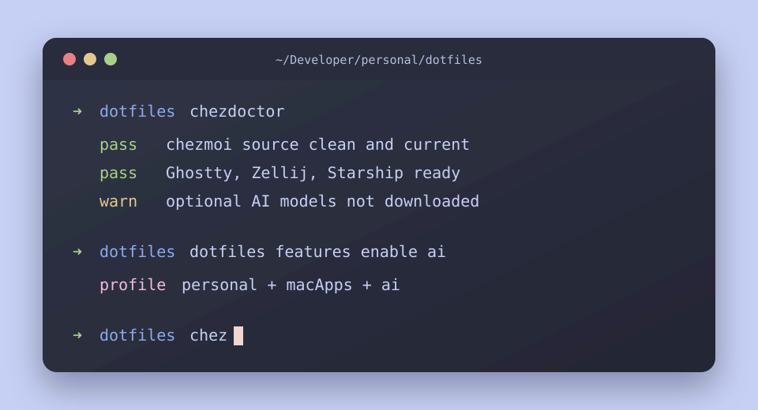

# dotfiles

[](https://github.com/martinzachariassen/dotfiles/actions/workflows/ci.yml)
[](https://www.apple.com/macos/)
[](https://chezmoi.io)
[](https://github.com/catppuccin/catppuccin)
[](LICENSE)

Personal macOS setup, managed by [chezmoi](https://chezmoi.io). One command turns a fresh Mac into a backend workstation with terminal, shell, editors, Homebrew apps, mise-managed language runtimes, and macOS defaults wired up. The installer defaults to a short fresh-Mac path, with cleanup, feature toggles, and git signing setup available when the required software is actually installed.



## Start here

Pick the scenario that matches your machine. Everything below runs as your normal macOS user — **never with `sudo`**. Homebrew and the macOS steps ask for your password themselves when they need privileged changes. Every step is idempotent and safe to re-run.

### 1. Brand-new Mac

One command bootstraps Xcode Command Line Tools, Homebrew, this repo, all packages, and macOS defaults:

```sh
curl -fsSL https://raw.githubusercontent.com/martinzachariassen/dotfiles/main/install.sh | bash
```

Fresh installs ask only for profile, git name, and git email up front. The wizard explains each prompt inline, uses normal text input instead of special key handling, and falls back to plain ASCII when the terminal cannot render box-drawing characters. The heavy parts show progress: Xcode CLT/Homebrew bootstrap gets a heartbeat, then packages split into per-tap/formula/cask progress.

When the wizard finishes, sign in and reload:

```sh
open -a 1Password                                      # skip if disabled
bash ~/Developer/personal/dotfiles/scripts/bootstrap-auth.sh   # finishes git signing
exec zsh                                               # reload the managed shell
chezdoctor                                             # verify everything is healthy
sudo shutdown -r now                                   # reboot to finish macOS defaults
```

### 2. Existing Mac with an older setup

Use the **same installer** — it snapshots any pre-existing legacy dotfiles into a timestamped backup before taking over (skip with `SKIP_BACKUP=1`), then converges the machine to the current config:

```sh
curl -fsSL https://raw.githubusercontent.com/martinzachariassen/dotfiles/main/install.sh | bash
```

If the machine **already tracks these dotfiles**, just pull and apply instead:

```sh
chezup
```

Either path automatically runs the **deprecation cleanup** so you don't carry forward tools the repo no longer manages. It:

- uninstalls the Homebrew packages this repo dropped (`node`, `temurin@21`, `temurin@25`, `direnv`) — language runtimes now come from **mise**;
- removes the old out-of-band `devbox` binary and the leftover `~/.config/direnv` config; and
- asks **y/N before deleting the old `/nix` store** from the previous devbox stack (it needs sudo and can't be undone — answer `n` to keep it, remove it later with `/nix/nix-installer uninstall`).

On a fresh machine that never had the old stack, the cleanup is a silent no-op. Afterward, reload the shell so mise activation takes effect and sanity-check:

```sh
exec zsh
chezdoctor      # warns about any leftover devbox/Nix/direnv it couldn't remove
```

> **Coming from the devbox/direnv setup?** Runtimes (Java/Node) are now managed by mise: global defaults live in `~/.config/mise/config.toml`, and each project pins its own versions + env vars in a committed `mise.toml` (its `[env]` block replaces `.envrc`). See [What you get](docs/what-you-get.md) and [examples/mise/](examples/mise/).

### 3. Already set up — staying current

```sh
chezup       # pull latest repo changes, preview, then apply
```

Only changing profile, identity, or feature toggles (no full bootstrap):

```sh
bash ~/Developer/personal/dotfiles/install.sh --configure-only
```

<details>
<summary>Advanced install flags</summary>

```sh
DRY_RUN=1       bash install.sh   # print state-changing commands without running them
YES=1           bash install.sh   # accept recommended defaults
SKIP_BACKUP=1   bash install.sh   # do not snapshot pre-existing legacy dotfiles
DOTFILES_REPO=<repo-url> bash install.sh   # point at a fork
DOTFILES_DIR=<path>      bash install.sh   # clone somewhere else
```

Guarded Homebrew cleanup modes:

```sh
bash install.sh --mirror-brew  # remove packages not in the active Brewfiles
bash install.sh --reset-brew   # uninstall everything first, then reinstall
```

</details>

## Daily commands

The whole everyday surface is **two verbs plus a health check**. Both verbs end
in the same `chezmoi apply`, which now reconciles *real installed state* on every
run — so "make this Mac match the repo" always installs what the Brewfile
declares (no separate fix step). See [Lifecycle](docs/lifecycle.md).

| Command | Use |
|---|---|
| `chezup` | **Converge this Mac to the repo:** pull the latest changes, apply, and install any missing packages. The everyday command. |
| `install.sh` | **Bootstrap a new Mac** from scratch (the same apply path under the hood). |
| `chezdoctor` | Read-only health check for repo, chezmoi, brew, auth, signing, mise, and shell layout. |

<details>
<summary>Advanced / occasional commands</summary>

| Command | Use |
|---|---|
| `dotfiles` | Jump to the source repo. With arguments, manage profile/features. |
| `chez` | Apply without pulling — the building block `chezup` calls. |
| `chezreinit` | Pull, re-run `chezmoi init` to pick up new data-model keys, then apply. Use after wizard/data-model changes. |
| `chezbump` | Routine dependency upgrade (`brew upgrade` + `mise upgrade`). |
| `chezaudit` | List Homebrew packages installed locally but not tracked in any Brewfile. |

</details>

Common profile and feature changes:

```sh
dotfiles profile set personal
dotfiles profile set work
dotfiles features list
dotfiles features enable macApps
dotfiles features disable macApps
```

## What you get

| Area | Baseline |
|---|---|
| Terminal | Ghostty, Zellij, Starship, Catppuccin Frappe, JetBrainsMono Nerd Font. |
| Shell | zsh with XDG layout, fzf, zoxide, Carapace completions, syntax highlighting, and modern CLI aliases. |
| Local AI | Part of the default `macApps` module: Ollama (run as a brew service) plus the Codex, ChatGPT, Claude, and Claude Code apps. Pull models manually with `ollama pull`. |
| Git | 1Password SSH signing, delta diffs, useful aliases, pull rebase, rerere. |
| Project tools | mise for per-project language runtimes (Java/Node/Python); CLIs and database servers via Homebrew or Docker. |
| Editors | VS Code via Homebrew, Neovim with LazyVim for terminal work. |
| Workstation apps | Homebrew-managed core apps, optional mac app extras, and profile-specific personal/work layers. |
| macOS | Keyboard, Finder, Dock, screenshots, TextEdit, and security defaults. |

See [What you get](docs/what-you-get.md) for the full table and prompt examples.

## Documentation

| Page | Use it for |
|---|---|
| [Lifecycle](docs/lifecycle.md) | The two-verb model (bootstrap vs converge), the convergence guarantee, and the command map. Start here. |
| [Bootstrap](docs/bootstrap.md) | Wizard flow, profiles, features, secrets, signing, and macOS privacy permissions. |
| [Day-to-day](docs/day-to-day.md) | Chezmoi mental model, adding tools, previewing changes, aliases, and `doctor.sh`. |
| [Upgrading](docs/upgrading.md) | `chezup`, `chezreinit`, invalidation rules, and long-absence maintenance. |
| [Troubleshooting](docs/troubleshooting.md) | Known failure modes and recovery commands. |
| [Architecture](docs/architecture.md) | Chezmoi file classes, remove markers, ignored files, and apply scripts. |
| [Wizard internals](docs/wizard.md) | How `install.sh`'s prompts and TTY handling work, the invariants, and how to validate changes without breaking it. |
| [AI tools](docs/ai-tools.md) | How Claude Code, Codex, and Copilot read this repo — user-level config, the `AGENTS.md` bridge, and local LLM setup. |
| [Forking](docs/forking.md) | What to change when basing your own setup on this repo. |
| [Uninstall / reset](docs/uninstall-reset.md) | Homebrew mirror/reset and manual rollback notes. |
| [Reference](docs/reference.md) | Links to the important repo files. |

Other useful references:

- [Mapping](docs/mapping.md) maps every managed source file to its target in `$HOME`.
- [examples/](examples/) contains mise and pre-commit starter files.

## License

MIT. See [LICENSE](LICENSE).
