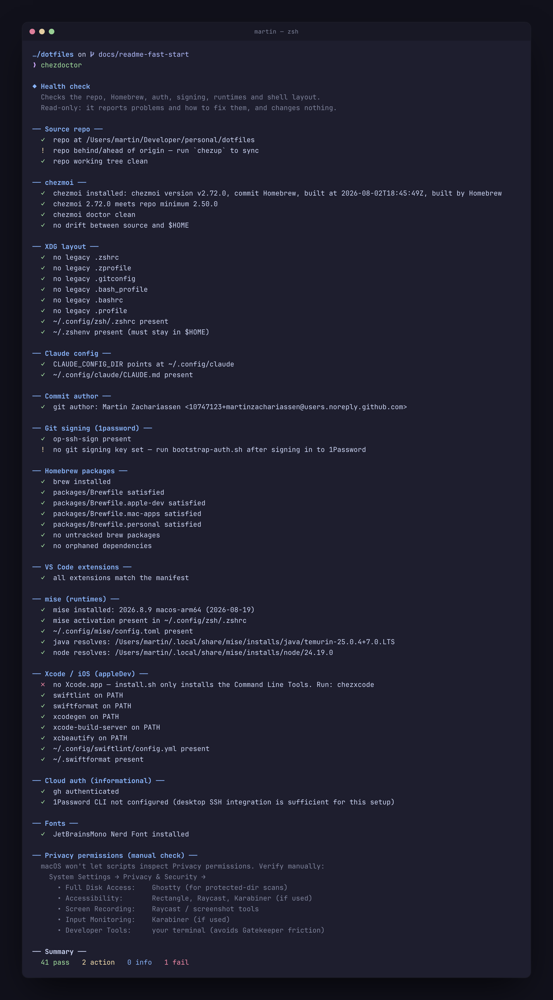
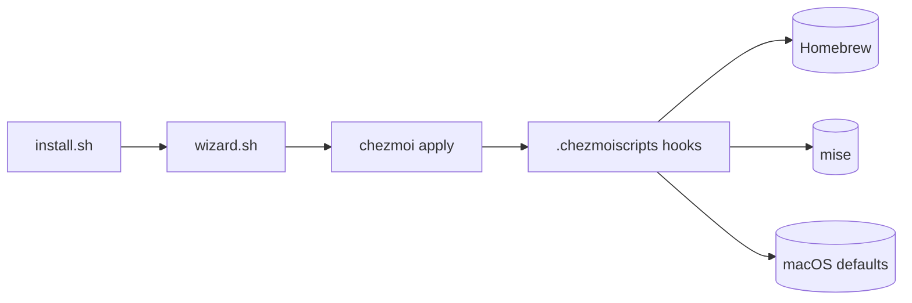

# dotfiles

One command turns a fresh Apple Silicon Mac into a working backend/iOS workstation — shell, terminal, editors, runtimes, apps and macOS defaults — managed by [chezmoi](https://chezmoi.io).

[](https://github.com/martinzachariassen/dotfiles/actions/workflows/ci.yml)
[](LICENSE)


<sup>A re-run on a Mac that already has everything — it explains itself before it starts, then skips each step it finds done.</sup>

## Install

```sh
curl -fsSL https://raw.githubusercontent.com/martinzachariassen/dotfiles/main/install.sh | bash
```

That's the whole install. It works on a fresh Mac *and* on one you've been using for years, it explains each step as it goes, and it's safe to re-run — every step checks first and skips what's already done.

> [!IMPORTANT]
> **It does not back up your existing dotfiles.** The first run overwrites `~/.zshrc`, `~/.gitconfig`, `~/.bash_profile`, `~/.bashrc`, `~/.profile` and `~/.zprofile`. Copy anything you want to keep somewhere safe first.

### What it does — about 15–25 minutes

Almost all of it is downloading. You'll be asked for your macOS password (Homebrew first, then again later for app installs and system settings) — each prompt says why before it appears, waits on a clean screen rather than behind a progress bar, and tells you when it's been accepted.

| # | Step | |
| --- | --- | --- |
| 1 | Xcode Command Line Tools | Apple's compilers. Homebrew needs them. **Not Xcode itself.** |
| 2 | Homebrew | The package manager everything else uses. |
| 3 | chezmoi | Renders this repo into your home folder. |
| 4 | Clone this repo | Into `~/Developer/personal/dotfiles`. |
| 5 | Setup wizard → apply | Four questions, then it installs everything. |

### The four questions

Plain `read` prompts and a pure-bash picker — so it works under `curl | bash` on a Mac with
nothing installed yet. Sensible defaults throughout, and every answer is changeable later
with `chezsetup`.

| Question | Options | If unsure |
| --- | --- | --- |
| **Name + email** | for git commits | Your GitHub noreply address is fine. Don't leave the email blank — git refuses to commit without one. |
| **Profile** | `personal` · `work` · `minimal` | `personal`. It picks which package sets you get. |
| **Optional modules** | apps, macOS defaults, theme, JVM, Swift/iOS… | Keep the defaults for your profile. |
| **Git commit signing** | `1password` · `ssh-key` · `off` | On a **fresh** Mac, choose to set the key **later** — it's still locked inside 1Password, which hasn't been installed yet. |

### When it finishes

The apply prints these for you, in order:

```sh
exec zsh                                                          # 1. reload the managed shell
chez auth                                                         # 2. sign in to gh / cloud CLIs
chez doctor                                                       # 3. health-check everything
```

If you deferred the signing key, open 1Password, enable its SSH agent (**Settings → Developer**), then run `chez sign` — it offers the keys the agent already holds, so there's nothing to paste. Reboot when you're done; some macOS defaults only take effect on login.

## Day to day

Three verbs cover almost everything. `chezhelp` prints the rest.

| Command | What it does |
| --- | --- |
| `chezup` | **The one you run.** Pull latest → show what will change → apply. |
| `chezdoctor` | Read-only health check: repo, brew, auth, signing, mise, shell. Fixes nothing. |
| `chezstatus` | Explains pending file and package drift in plain words. |

Prefix any of them with `DRY_RUN=1` to print what the verb would do instead of doing it.

<details>
<summary><b>What <code>chezdoctor</code> reports</b></summary>



Every check names the fix. It changes nothing — the two `!` lines and the one `✗` above are this Mac's real state, not a mock-up.

</details>

**An apply only ever adds.** It renders files, installs what the Brewfiles declare, and runs `mise install` — it never uninstalls anything. Removing what the repo no longer tracks is a separate, confirm-gated step you run by hand (`chezmirror` for packages, `chezclean` for dotfiles).

## What you get

| Area | Baseline |
| --- | --- |
| Terminal | [Ghostty](https://ghostty.org), [Zellij](https://zellij.dev), [Starship](https://starship.rs), Catppuccin Mocha, JetBrainsMono Nerd Font |
| Shell | zsh with XDG layout, fzf, zoxide, Carapace completions, syntax highlighting, modern CLI aliases |
| Editors | VS Code via Homebrew (extensions in [`features/vscode/extensions.txt`](features/vscode/extensions.txt)), Neovim with LazyVim |
| Git | 1Password SSH signing, delta diffs, useful aliases, pull rebase, rerere |
| Runtimes | [mise](https://mise.jdx.dev) for per-project Java/Node/Python; global defaults in `~/.config/mise/config.toml` |
| iOS / Swift | Optional `appleDev` module: SwiftLint, SwiftFormat, [xcodes](https://github.com/XcodesOrg/xcodes), xcbeautify, fastlane, SF Symbols. Xcode itself comes from `chezxcode` (Apple ID, ~40 GB), not from an apply |
| AI | Default `macApps` module: the Claude and Claude Code apps |
| Apps | Homebrew-managed core apps, optional Mac app extras, profile-specific personal/work layers |
| macOS | Keyboard, Finder, Dock, screenshots, TextEdit, and security defaults — [full list](docs/macos.md) |

---

<details>
<summary><b>Forking this for your own Mac</b></summary>

This is tuned to one person's Apple Silicon Mac — the profiles and modules exist for my own personal/work split, not as a general customization framework. It forks cleanly, but expect to swap in your own choices:

| Change | Where |
| --- | --- |
| Packages and apps | [`features/brew/Brewfile*`](features/brew/) — core, per-profile, per-module |
| VS Code extensions | [`features/vscode/extensions.txt`](features/vscode/extensions.txt) |
| Optional modules | [`src/.chezmoidata/modules.toml`](src/.chezmoidata/modules.toml) — the catalog and per-profile defaults |
| macOS defaults | [`features/macos/cli.sh`](features/macos/cli.sh) ([what it sets](docs/macos.md)) |
| Repo URL in the installer | `REPO` in [`install.sh`](install.sh), or point at your fork without editing: `DOTFILES_REPO=<url> bash install.sh` |

Install from a fork without touching the installer:

```sh
DOTFILES_REPO=https://github.com/you/dotfiles.git \
  bash -c "$(curl -fsSL https://raw.githubusercontent.com/you/dotfiles/main/install.sh)"
```

`DOTFILES_DIR=<path>` clones somewhere other than `~/Developer/personal/dotfiles`. Any extra argument to `install.sh` skips the wizard and forwards straight to `chezmoi init --apply` — `… | bash -s -- --promptDefaults` is the non-interactive/CI path. More in [docs/install.md](docs/install.md#advanced-flags).

</details>

<details>
<summary><b>The full command set</b></summary>

Every `chez*` verb is a zsh function in [`src/dot_config/zsh/dot_zshrc.tmpl`](src/dot_config/zsh/dot_zshrc.tmpl) that delegates to a script in [`scripts/bin/`](scripts/bin).

| Command | What it does |
| --- | --- |
| `chezup` | Converge this Mac to the repo. Pull latest → preview the drift → apply. |
| `chezdoctor` | Read-only health check: repo, chezmoi, brew, auth, signing, mise, shell layout, distiller. |
| `chezstatus` / `chezapply` | Explain pending drift, or apply without pulling. Both read the same `chezmoi status`. |
| `chezsetup` | Re-run the wizard to change profile/modules (`--reset`/`-r`), or just fill in newly added keys. |
| `chezsign` | Set **only** the git signing key, replaying every other answer untouched. |
| `chezmirror` / `chezclean` | Confirm-gated **removal**: untracked Homebrew packages, and untracked dotfiles under `$HOME`/`~/.config`. The deliberate, manual undo an apply never does. |
| `chezreconcile` / `chezbump` | Full package reconcile in one step (install + remove), or a routine `brew`/`mise` upgrade. |
| `chezxcode` | Install Xcode.app, select it, accept the licence, fetch a simulator runtime. Needs an Apple ID; ~40 GB. |
| `chezdistill` | Distil this Mac's Claude Code conversations nightly into the `MAIN.md` every future session loads (`~/.config/claude/memory`), from a corpus in `~/.local/state/chezdistill`. |

Full reference including `DRY_RUN=1`/`YES=1` and what each verb touches: [docs/commands.md](docs/commands.md).

</details>

<details>
<summary><b>How it works</b></summary>

`install.sh` is a tiny bootstrap fetched via `curl | bash` **before the repo exists on disk** — it installs only the prerequisites, then hands off to the setup wizard, which feeds your answers to `chezmoi init --apply`. `chezup` runs that same `chezmoi apply` every time after, which is what makes this convergent (it reconciles real installed state against the repo) rather than a one-shot script you can only run once.



The repo root splits into **what chezmoi deploys** (everything under `src/`, its source directory per [`.chezmoiroot`](.chezmoiroot)) and **the tooling that supports it** (everything else — `scripts/`, `packages/`, `tests/`, `docs/`, `install.sh`, never rendered to `$HOME`). The wizard is a plain-text picker because chezmoi's own raw-mode TUI is unreliable under `curl | bash`.

</details>

<details>
<summary><b>Developing on it</b></summary>

```sh
shellcheck install.sh scripts/bin/*.sh scripts/ci/*.sh scripts/lib/*.sh   # lint shell
bats tests/                                                               # unit tests
pre-commit run --all-files                                                # the full local gate set
```

CI ([`ci.yml`](.github/workflows/ci.yml)) runs the same gates: `shellcheck`, `shfmt`, `typos`, config validation, the full chezmoi render matrix across profiles and modules, the bats suites, Homebrew name resolution, and Conventional Commit titles. Detail: [docs/development.md](docs/development.md).

Edit sources under `src/` — never the rendered copies in `$HOME`, since every apply entry point passes `--force` and overwrites local drift. `CLAUDE.md` has the working conventions.

**Contributing:** this is a personal, single-machine setup, so I'm not chasing external contributions — but issues and small PRs (typo fixes, a broken link, a genuine bug) are welcome. Run `pre-commit run --all-files` and `bats tests/` first.

</details>

## Documentation

| Doc | Covers |
| --- | --- |
| [install.md](docs/install.md) | Bootstrap scenarios, `install.sh` flags, cleaning up drift |
| [commands.md](docs/commands.md) | Every verb — `chezup`, `chezdoctor`, and the occasional helpers |
| [packages.md](docs/packages.md) | Package tiers, profiles, the module catalog, and the wizard |
| [architecture.md](docs/architecture.md) | The `src/` split, repo layout, and `scripts/` organization |
| [lifecycle.md](docs/lifecycle.md) | What `chezmoi apply` does, stage by stage |
| [macos.md](docs/macos.md) | Every macOS system setting applied |
| [development.md](docs/development.md) | Quality gates, the CI matrix, and the bats suites |
| [shell.md](docs/shell.md) · [terminal.md](docs/terminal.md) · [editors.md](docs/editors.md) · [ai.md](docs/ai.md) | The configured environment — zsh/CLI/mise/git, Ghostty/Zellij/Starship, VS Code/Neovim, and AI tooling |

## License

[MIT](LICENSE) © [Martin Zachariassen](https://mlz.no)

---

<div align="center">
<sub>Built for a single Apple Silicon Mac · managed by <a href="https://chezmoi.io">chezmoi</a> · converges with one command · <a href="https://mlz.no">mlz.no</a></sub>
</div>
