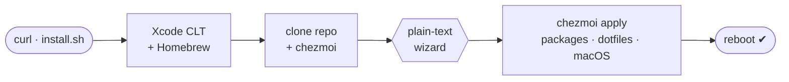

<div align="center">

# ✦ dotfiles ✦

### *One command turns a fresh Mac into a backend workstation.*

[](https://github.com/martinzachariassen/dotfiles/actions/workflows/ci.yml)
[](https://www.apple.com/macos/)
[](https://chezmoi.io)
[](#-command-reference)
[](https://github.com/catppuccin/catppuccin)
[](https://www.conventionalcommits.org)
[](https://github.com/martinzachariassen/dotfiles/commits/main)
[](LICENSE)

Personal macOS setup managed by [**chezmoi**](https://chezmoi.io) — terminal, shell, editors,
Homebrew apps, [**mise**](https://mise.jdx.dev)-managed runtimes, and macOS defaults, all wired up.

<br>

```sh
curl -fsSL https://raw.githubusercontent.com/martinzachariassen/dotfiles/main/install.sh | bash
```

<sub>🍎 **Apple Silicon** · 🙅 **no `sudo` lifestyle** · 🔁 **safe to re-run anytime**</sub>

<!-- Hero screenshot slot: drop a terminal shot at assets/hero.png and uncomment.

-->

</div>

---

## Contents

- [✨ Highlights](#-highlights)
- [📦 What you get](#-what-you-get)
- [🚀 Getting going](#-getting-going)
  - [Brand-new Mac](#brand-new-mac)
  - [Existing Mac with an older setup](#existing-mac-with-an-older-setup)
  - [Already set up — staying current](#already-set-up--staying-current)
- [⌨️ Command reference](#-command-reference)
- [⚙️ How it works](#-how-it-works)
- [🗂 Repository layout](#-repository-layout)
- [📚 Documentation](#-documentation)
- [🛠 Development](#-development)
- [📄 License](#-license)

---

## ✨ Highlights

<table>
  <tr>
    <td width="33%" valign="top">
      <h3>🧙 One-command bootstrap</h3>
      A single <a href="install.sh"><code>curl | bash</code></a> takes a fresh (or legacy)
      Mac from zero to a fully configured workstation — Xcode CLT, Homebrew, this repo,
      every package, and macOS defaults.
    </td>
    <td width="33%" valign="top">
      <h3>🔁 Idempotent &amp; convergent</h3>
      <code>chezmoi apply</code> reconciles <em>real installed state</em> on every run.
      "Make this Mac match the repo" always works — re-run anytime, no separate fix step.
    </td>
    <td width="33%" valign="top">
      <h3>🙅 No <code>sudo</code> lifestyle</h3>
      Everything runs as your normal user. Homebrew and the macOS steps ask for your
      password themselves, only when they actually need it.
    </td>
  </tr>
  <tr>
    <td width="33%" valign="top">
      <h3>🎯 Two everyday verbs</h3>
      <a href="install.sh"><code>install.sh</code></a> bootstraps a fresh Mac;
      <a href="scripts/bin/chezup.sh"><code>chezup</code></a> converges an existing one
      (pull → preview → apply).
    </td>
    <td width="33%" valign="top">
      <h3>🧩 Layered packages</h3>
      A core <a href="packages/Brewfile">Brewfile</a> plus composable
      <a href="packages/">profile + module layers</a> (mac-apps, personal, work),
      chosen in the setup wizard and mapped in <code>src/.chezmoidata/packages.toml</code>.
    </td>
    <td width="33%" valign="top">
      <h3>✅ CI-guarded</h3>
      Every push lints shell, renders the full template matrix, runs
      <a href="tests/">bats suites</a>, and enforces Conventional Commits.
    </td>
  </tr>
</table>

> Targets **macOS on Apple Silicon**. Everything runs as your normal user — **never with `sudo`**.

## 📦 What you get

| Area | Baseline |
|---|---|
| 🖥 **Terminal** | Ghostty, Zellij, Starship, Catppuccin Frappé, JetBrainsMono Nerd Font. |
| 🐚 **Shell** | zsh with XDG layout, fzf, zoxide, Carapace completions, syntax highlighting, modern CLI aliases. |
| ✏️ **Editors** | VS Code via Homebrew (extensions in [`packages/vscode-extensions.txt`](packages/vscode-extensions.txt)), Neovim with LazyVim. |
| 🔀 **Git** | 1Password SSH signing, delta diffs, useful aliases, pull rebase, rerere. |
| 📦 **Runtimes** | mise for per-project Java/Node/Python; global defaults in `~/.config/mise/config.toml`. |
| 🤖 **Local AI** | Default `macApps` module: Ollama (brew service) plus the Claude and Claude Code apps. |
| 🧰 **Workstation apps** | Homebrew-managed core apps, optional Mac app extras, profile-specific personal/work layers. |
| 🍎 **macOS** | Keyboard, Finder, Dock, screenshots, TextEdit, and security defaults — [full list](docs/macos.md). |

## 🚀 Getting going

Pick the scenario that matches your machine. Every step is idempotent and safe to re-run.



> **Fastest path:** run the one-liner from the top of this README, follow the wizard, then reboot. The three scenarios below just add the before/after detail for each starting point.

### Brand-new Mac

One command bootstraps Xcode Command Line Tools, Homebrew, this repo, all packages, and macOS defaults:

```sh
curl -fsSL https://raw.githubusercontent.com/martinzachariassen/dotfiles/main/install.sh | bash
```

When the wizard finishes, sign in and reload:

```sh
open -a 1Password                                              # skip if disabled
bash ~/Developer/personal/dotfiles/scripts/bin/bootstrap-auth.sh  # finishes git signing
exec zsh                                                       # reload the managed shell
chezdoctor                                                     # verify everything is healthy
sudo shutdown -r now                                           # reboot to finish macOS defaults
```

### Existing Mac with an older setup

Use the **same installer** — it snapshots any pre-existing legacy dotfiles into a timestamped backup before taking over (skip with `SKIP_BACKUP=1`), then converges the machine:

```sh
curl -fsSL https://raw.githubusercontent.com/martinzachariassen/dotfiles/main/install.sh | bash
```

It also runs the **[deprecation cleanup](docs/install.md#deprecation-cleanup)** so you don't carry forward tools the repo no longer manages (old `node`/`temurin` casks, devbox, direnv, the `/nix` store). Afterwards, reload and sanity-check:

```sh
exec zsh
chezdoctor      # warns about any leftover devbox/Nix/direnv it couldn't remove
```

> **Coming from the devbox/direnv setup?** Runtimes are now managed by mise — see [docs/shell.md](docs/shell.md#runtimes-mise) and the [migration note](docs/install.md#coming-from-the-devboxdirenv-setup).

### Already set up — staying current

```sh
chezup       # pull latest repo changes, preview, then apply
```

Only changing profile, identity, modules, or signing (no full bootstrap) — the
plain-text [wizard](docs/packages.md#the-wizard) re-asks the questions, then
applies for you:

```sh
bash ~/Developer/personal/dotfiles/scripts/bin/wizard.sh
```

> The wizard replaces chezmoi's own TUI picker, which is unreliable under
> `curl | bash`. It asks with plain prompts (three tiers that degrade to fit the
> terminal), then feeds chezmoi the answers as flags. To set the Mac up **as
> new**, use `chezreset`. Full detail — the prompt tiers and the install flags
> (`DOTFILES_REPO`, `DOTFILES_DIR`, `--promptDefaults`) — is in
> [docs/install.md](docs/install.md#advanced-flags) and
> [docs/packages.md](docs/packages.md#the-wizard).

## ⌨️ Command reference

Every `chez*` verb is a zsh function defined in
[`src/dot_config/zsh/dot_zshrc.tmpl`](src/dot_config/zsh/dot_zshrc.tmpl), delegating to a
script in [`scripts/bin/`](scripts/bin). **You only need two of them day to day** — `chezup`
to converge and `chezdoctor` to check health. The rest are there when you change your setup or
manage package drift.

> 💡 Forget one? Run **`chezhelp`** in your terminal — it prints this whole list, grouped, with a one-line description each.

Both `chezup` and `chez` end in the same `chezmoi apply`, which reconciles *real installed
state* on every run — so it always **installs** what the Brewfile declares. It never
**uninstalls**: `chez` only *flags* packages you have but the Brewfile doesn't, and
`chezmirror` reconciles that removal direction on demand, behind a per-package confirm.

### 🟢 Everyday — the two you'll actually type

| Command | What it does |
|---|---|
| **`chezup`** | **Converge this Mac to the repo.** Pull latest → preview the drift → apply. The one command you run most. |
| **`chezdoctor`** | Read-only **health check**: repo, chezmoi, brew, auth, signing, mise, and shell layout. Fixes nothing — just tells you what's off. |

<details>
<summary><code>chezup</code> — the three phases (and its knobs)</summary>

<br>

`chezup` honours two env vars and passes trailing args straight to `chezmoi apply`:

```sh
chezup                  # pull → preview → apply (one confirm gate)
DRY_RUN=1 chezup        # print every step, run nothing
YES=1 chezup            # skip the confirm gate (unattended)
chezup -v               # trailing args forwarded to `chezmoi apply`
```

1. **Update repo** — `git pull --ff-only` in the source dir; reports how many commits arrived.
2. **Review** — `chezmoi status` lists drift (`A` add · `M` modify · `D` remove). Stops here if nothing changed.
3. **Apply** — one confirmation gate, then `chezmoi apply --force`.

</details>

### 🔧 Change your setup — re-run the wizard

| Command | What it does |
|---|---|
| **`chezreset`** | Set this Mac up **as new**: reset chezmoi's run-once state so `run_once_*` / `run_onchange_*` hooks fire again, **re-ask the full wizard** (overriding saved answers), then apply. Confirm-gated; never uninstalls or deletes files. |
| **`chezreinit`** | Fill in **newly-added** setup keys only. Runs plain `chezmoi init` (via `prompt*Once`), so it *keeps* every answer you've already given and only asks what's still blank. Use after a data-model change — **not** to re-choose. |

> **`chezreset` vs `chezreinit`:** want to re-pick profile / modules / signing? → `chezreset`.
> Just added a new question to the data model and want existing machines to answer it? → `chezreinit`.

### 🧹 Maintenance — packages & drift

| Command | What it does |
|---|---|
| **`chez`** | Apply **without pulling** — the building block `chezup` calls. Flags Brewfile drift (installed but untracked); never uninstalls. |
| **`chezbump`** | Routine dependency upgrade: `brew update && brew upgrade` + `mise upgrade`. |
| **`chezaudit`** | List Homebrew packages installed locally but **not tracked** in any Brewfile. Reports only — acts on nothing. |
| **`chezmirror`** | Enforce the Brewfile as truth in the **removal** direction: preview untracked packages (union of all tiers), then confirm **each uninstall one at a time** (via `gum` when installed). |
| **`dotfiles`** | Jump to the source repo. With args, points you at `chezreset` / `chezreinit`. |

> **Why `apply` never uninstalls.** An apply must be safe to run at any time, so it only ever
> *adds* presence. Freshness is `chezbump`'s job; *removal* is `chezmirror`'s, always behind a
> confirm. Full rationale in [docs/lifecycle.md](docs/lifecycle.md#convergence-guarantee).

### 🔩 Under the hood

| Command | What it does |
|---|---|
| `chezhelp` | **Print this command list** in your terminal — grouped, one line each. The discoverable entry point. |
| `install.sh` | **Bootstrap a new Mac** from scratch — the `curl \| bash` entry point (same apply path as `chezup`). |
| `wizard.sh` | The plain-text setup wizard (`chezreset` calls it). Run directly to change answers without a full bootstrap. |
| `macos-defaults` | (Re-)apply the macOS system defaults on their own — see [docs/macos.md](docs/macos.md). |

> **A verb says its script is missing?** The `chez*` functions bake the helper-script path into
> your `~/.config/zsh/.zshrc` at apply time, so a repo restructure that moves a script can leave
> an un-reapplied machine pointing at the old path. They now **self-heal** (pull + apply +
> reload). A shell whose rc predates that self-heal recovers with one direct run:
> `bash ~/Developer/personal/dotfiles/scripts/bin/chezup.sh && exec zsh`. Details in
> **[docs/commands.md](docs/commands.md#when-a-command-says-its-script-is-missing)**.

## ⚙️ How it works

`chezup` runs in three phases: **update repo** (`git pull --ff-only`), **review
pending changes** (`chezmoi status` — stops here if nothing drifted), then
**apply** (one confirm gate, then `chezmoi apply --force`). It honours `DRY_RUN=1`
and `YES=1`, and passes trailing args through to `chezmoi apply`.

`install.sh` is a tiny bootstrap fetched via `curl | bash` **before the repo
exists on disk**: it installs only the prerequisites (Xcode CLT → Homebrew →
chezmoi → clone), then hands off to the plain-text wizard, which feeds your
answers to `chezmoi init --apply`.

What `apply` does after that — the hook ordering, the convergence guarantee, and
where each piece lives — is in **[docs/lifecycle.md](docs/lifecycle.md)**.

## 🗂 Repository layout

The repo root splits cleanly into **what chezmoi deploys** (everything under
`src/`, its source directory — see [`.chezmoiroot`](.chezmoiroot)) and **the
tooling that supports it** (everything else at the root, never deployed to
`$HOME`):

```
src/          # ← chezmoi's source dir; everything here deploys to $HOME
packages/     # core Brewfile + profile/module layers + editor lists
scripts/      # tooling grouped by who runs it: bin/ (verbs), ci/ (checks), lib/ (helpers)
install.sh    # tiny bootstrap; hands off to `chezmoi init --apply`
tests/        # bats suites
docs/         # these guides
```

The full layout, chezmoi naming conventions, and the `{{ .chezmoi.workingTree }}`
path idiom are in **[docs/architecture.md](docs/architecture.md)**.

## 📚 Documentation

Deeper guides live in [`docs/`](docs/) ([index](docs/README.md)):

| Doc | Covers |
|---|---|
| [install.md](docs/install.md) | Bootstrap scenarios, `install.sh` flags, deprecation cleanup. |
| [commands.md](docs/commands.md) | Every verb — `chezup`, `chezdoctor`, and the occasional helpers. |
| [packages.md](docs/packages.md) | Package tiers, profiles, the module catalog, and the wizard. |
| [architecture.md](docs/architecture.md) | The `src/` split, repo layout, and `scripts/` organization. |
| [lifecycle.md](docs/lifecycle.md) | What `chezmoi apply` does, stage by stage. |
| [macos.md](docs/macos.md) | Every macOS system setting applied (keyboard, Finder, Dock, screenshots, security). |
| [development.md](docs/development.md) | Quality gates, the CI matrix, and the bats suites. |
| [shell.md](docs/shell.md) · [terminal.md](docs/terminal.md) · [editors.md](docs/editors.md) · [ai.md](docs/ai.md) | The configured environment — zsh/CLI/mise/git, Ghostty/Zellij/Starship, VS Code/Neovim, and AI tooling. |

## 🛠 Development

```sh
shellcheck install.sh scripts/bin/*.sh scripts/ci/*.sh scripts/lib/*.sh   # lint shell
bats tests/                                                               # unit tests
pre-commit run --all-files                                               # the full local gate set
```

CI ([`.github/workflows/ci.yml`](.github/workflows/ci.yml)) runs shellcheck, renders every chezmoi template across the profile/modules matrix, runs the bats suites, lints config, checks spelling, resolves Homebrew names on macOS, and enforces Conventional Commit PR titles. Full detail in **[docs/development.md](docs/development.md)**.

## 📄 License

MIT. See [LICENSE](LICENSE).

<div align="center">
<sub>Built for a single Apple Silicon Mac · converges with one command · runs as your normal user (only Homebrew &amp; macOS defaults ask for your password)</sub>
</div>
