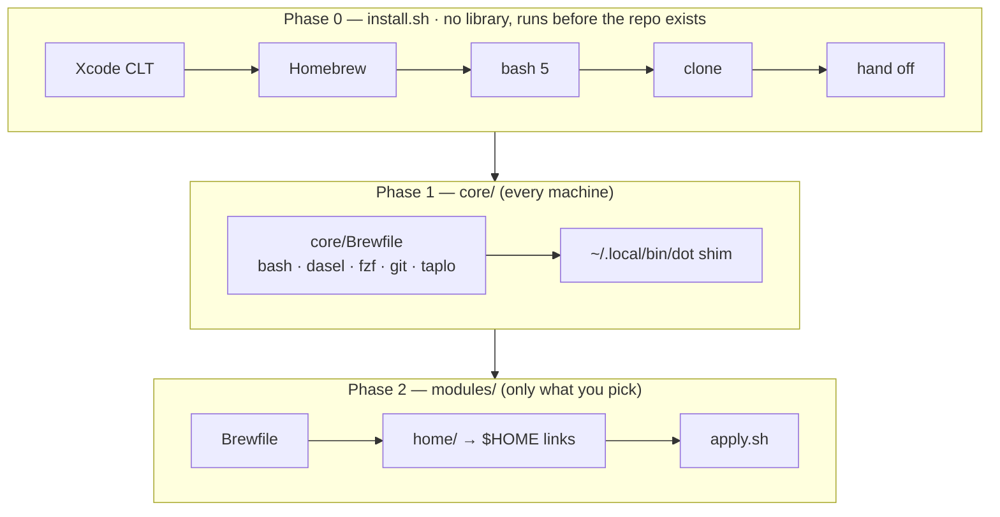
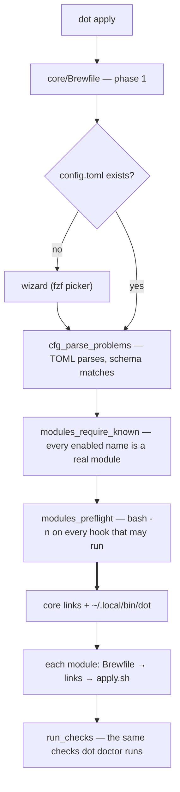
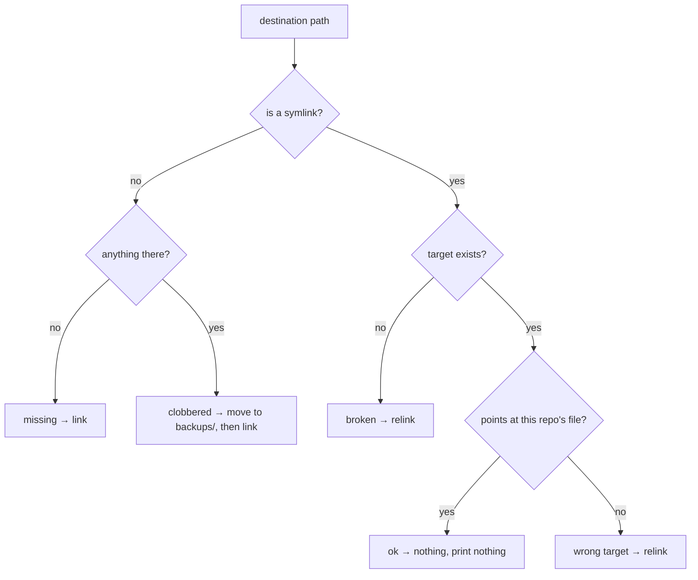
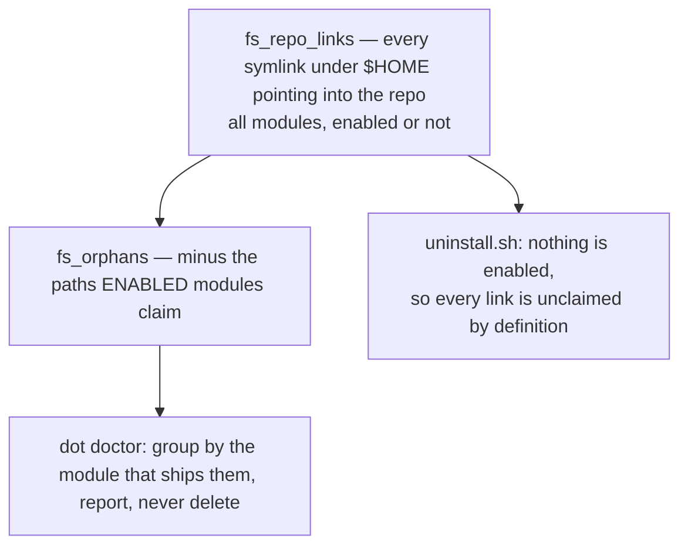

# Architecture

How a run is put together, and the four rules the whole design turns on.

[Three phases](#three-phases) · [Order of operations](#order-of-operations) ·
[The link engine](#the-link-engine) ·
[Derive, never record](#derive-never-record) ·
[Your files stay yours](#your-files-stay-yours) ·
[Dry runs](#dry-runs) ·
[What a run prints and returns](#what-a-run-prints-and-returns) ·
[Templating](#templating)

## Three phases

The order is load-bearing: each phase installs the tools the next one assumes.

Phase 1 is why the first-run picker can be one `fzf` call, and why
`config.toml` is read by a real TOML parser. `core/Brewfile` is machinery only:
something in `lib/`, `bin/` or `core/` runs each package, or every machine
needs it.

Within a module the order is fixed — **Brewfile → links → `apply.sh`** — so
`apply.sh` may always assume its packages and config files are in place.

`install.sh` shares nothing with the rest of the repo: plain `echo`, no
library, because it is fetched by `curl` and runs before the clone exists. A
`source` of anything under `lib/` would work on the developer's machine and
fail on every fresh one.

## Order of operations

Nothing writes before everything has been read.

Everything above the thick arrow only reads. `modules_preflight` is the last
gate: a syntax error in `modules/x/apply.sh` must not surface halfway through
an apply that has already relinked.

An apply ends by *observing* the machine rather than reporting what it
attempted. That tail is `dot doctor`'s own code, safe there because
`tests/contract.bats` proves no `doctor.sh` writes to `$HOME`.

## The link engine

Leaf files under a module's `home/` are **symlinked** into `$HOME` at the same
relative path, so editing `~/.config/git/config` edits the file in the repo.

Two rules, and a bug in either loses files:

- **Directories are never symlinked, only traversed.** If `~/.config` were a
  link into the repo, one module would own the whole tree and every other
  tool's files would vanish.
- **A real file in the way is moved, never overwritten** — to
  `~/.local/state/dotfiles/backups/<timestamp>/`. After a collision it exists
  in exactly one place. A real *directory* is moved the same way, whole, and
  both `apply` and `doctor` say "directory" rather than "file" so the report
  matches the size of what just happened.

The same classifier drives linking and the drift report, so `dot doctor` names
these states in the words you will actually see — `not linked`, `wrong target`,
`real file`, `real directory`, `broken link`. It reports them; it never deletes
anything in your home directory on its own.

## Derive, never record

There is no state file. What is installed is worked out by looking, so it
cannot go stale — and uninstall becomes a special case of a scan that already
existed:

The scan is bounded rather than a walk of your whole home directory: every
directory on the path to a file some module ships, and one level past each.
That extra level catches a directory the repo *stopped* shipping into — rename
a skill and the link left behind is still found. The boundary is pinned in
`tests/orphans.bats`.

Orphans are grouped by the module that ships them, because the two causes need
opposite advice. A path the repo no longer ships is finished by the `rm`. A
module you switched off is not: `rm` would leave you believing the machine was
clean while its `defaults`, generated files and links outside the repo are all
still there. So the report names the module and its `remove.sh` — or says
outright that the module leaves nothing else behind.

A module therefore only needs a `remove.sh` for what the sweep structurally
cannot see. The four kinds are listed in [modules.md](modules.md#removesh).

## Your files stay yours

**Nothing here deletes a real file.** Symlinks and provably-generated files
only, and the backup tree is never removed.

Where the repo must touch a file you own, it does so key-by-key and gives it
back the same way. `~/.claude/settings.json` is merged into with `jq`, and only
the leaves still holding exactly what was written are ever taken back.
`config.toml` is the same trade: `dot add` and `dot remove` splice one line
into one array and copy every other byte through, comments and spacing
included.

The proof is the array's shape. `dot config --init` writes one `"name",` per
line, and that is the only shape these will edit. Reformat it by hand —
`enabled = ["git", "zsh"]` — and they refuse and tell you to edit it yourself,
rather than rewrite a file they can no longer claim to understand.
Hand-editing is a supported workflow; being reformatted behind your back is
not.

## Dry runs

`--dry-run` is not a hand-written summary: it is the real code path with every
mutating helper turned into a `printf`, so it cannot disagree with the real
run. Intent is announced before acting. `tests/contract.bats` snapshots `$HOME`
around every `apply.sh` and every `remove.sh` to hold this.

## What a run prints and returns

Exit status is derived from tallies, never propagated by hand: `0` clean, `1`
if anything failed, `3` from a *hook* that only warned. Warnings never change
the status at the top level, so `dot doctor && …` survives an orphaned link.

`apply`, `add` and `remove` each keep a transcript and say where at the end —
`~/.local/state/dotfiles/logs/<timestamp>-<verb>.log`, one file per run, twenty
kept for the directory. Colour is stripped on the way into the file, so the log
reads in an editor as well as in a pager. `config` hands the terminal to your
editor and `doctor` changes nothing, so neither writes one. A dry run opens no
transcript either.

In the checking phase — `dot doctor`, and the tail of an apply — a module that
reports nothing wrong collapses to a single line. One that does expands,
showing only what needs attention, and the run ends by repeating those findings
rather than telling you to scroll. Applying streams instead of collapsing: a
`brew bundle` that takes two minutes has to be visible while it runs, not
afterwards.

The count in that last line is the count of the lines under it: a hook is a
separate process, so its findings reach the driver as records rather than as an
exit status, and three problems in one hook are counted as three. `dot doctor
--verbose` prints every check, passed ones included. `NO_COLOR` turns colour
off; a locale that is not UTF-8 falls back to ASCII markers of the same width.

## Templating

There isn't any, and that is a decision. Machine-local values go through the
tool's own include mechanism — `~/.config/git/config.local`, generated by
`modules/git/apply.sh`, and `~/.config/zsh/local.zsh`, sourced if present and
never tracked. If a generator ever needs a conditional, the conditional belongs
in the tool's own config language, not in bash.
