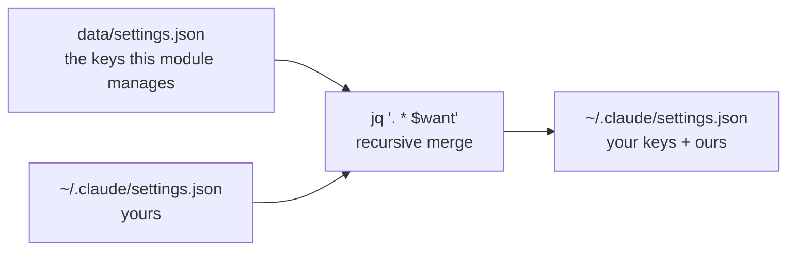
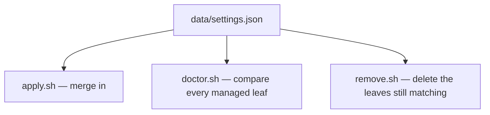

# claude-code

The Claude Code CLI, the status line it renders, and a handful of settings
merged into a file you own.

Most of this module is ordinary: `home/.claude/` holds `statusline.sh`, a theme
and skills, and they are symlinked like any other config. The interesting part
is `~/.claude/settings.json`, which is **not** linked — Claude Code writes to it
itself.

## Merging into a file you own

A recursive merge, so every key this module does not name survives — including
`.permissions.allow`, where an "Always allow" click lands.

Two rules keep that honest:

- **Manage only keys nothing else writes.** `/model` and the effort picker write
  back into this file; managing those would fight you on every apply.
- **Take back only what is still ours.** `remove.sh` walks the managed *leaves*
  — `.permissions.defaultMode` is ours, `.permissions` as a whole is not —
  deletes each one still holding exactly what apply wrote, then prunes only the
  objects this module itself emptied, deepest first. Anything you changed since
  stands. The file is never rewritten wholesale and never deleted.

`statusLine.command` has to be absolute, so `data/settings.json` carries `~/` and
each hook expands it against `$HOME`.

## Three hooks, one data file

`tests/contract.bats` pins that all three derive `$want` from the data file with
the same line, and that `doctor.sh` and `remove.sh` share one definition of
"leaf". A drifted definition would let `doctor` call a machine clean that
`remove` would then not clean up.

Drift here is invisible — a broken `statusLine` renders nothing, a changed theme
says nothing at all — so `doctor.sh` compares **every** managed leaf rather than
sampling. That is only fair because `apply.sh` manages no key Claude Code writes
back.

All three hooks also ask `jq -r type` rather than `jq -e .` before touching the
file. `-e` reports a valid `null` or `false` as unparseable, and "is it an
object" is the real requirement anyway: apply must not merge into an array that
remove then cannot take its keys back out of.

## Things that bite

- **`remove.sh` guards before it runs `jq`.** `uninstall.sh` calls every
  module's `remove.sh`, enabled or not, and `jq` comes from this module's own
  Brewfile. Computing `$want` first made the whole uninstall unrunnable on a
  machine that never enabled this module.
- **`chmod` before `mv`.** `mktemp` is `0600` and `mv` carries that onto the
  destination, so a `settings.json` you kept at `0644` came back private after
  every apply.
- **`if`, never `jq … && mv`.** `set -e` ignores a non-final member of an `&&`
  list, so a `jq` that died mid-merge printed the success line and exited `0`.

## Managed keys

The current set lives in [`data/settings.json`](data/settings.json): the status
line, theme, output style, cleanup period, notification toggles and
`permissions.defaultMode`. Add one there and all three hooks pick it up — there
is no second list to update, and no count here to go stale.
