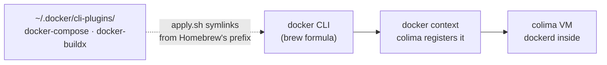

# containers

Docker on this machine is [colima](https://github.com/abiosoft/colima): a Linux
VM running dockerd, driven by the ordinary `docker` CLI. Docker Desktop is not
installed and is not wanted — it ships a GUI, a licence, and a privileged helper
for a daemon this replaces in one command.

```sh
colima start          # first run downloads the VM image; takes a few minutes
docker ps             # colima registered the docker context for you
colima stop           # reclaims the RAM
```



The plugins are linked rather than pointed at with `cliPluginsExtraDirs` in
`~/.docker/config.json`, which `docker login` owns. Their targets sit outside
`$DOT_ROOT`, which is why this module needs a `remove.sh` at all — the uninstall
sweep only sees links that point back into the repo.

## Not automatic

**Nothing starts the VM at login.** The previous dotfiles registered a launchd
agent for it: ~80 lines of `launchctl bootout`/`bootstrap` with a transient
failure mode, in exchange for saving one command on the mornings you actually
use Docker. `dot doctor` reports a stopped VM instead.

If you want it on a given machine, Homebrew already ships the service
definition, so there is no plist to write:

```sh
brew services start colima
```

That line stays out of `apply.sh` on purpose. Installing colima makes it
available; starting it at login changes how the machine behaves all day, for a
VM that holds its CPUs and RAM whether or not you open Docker. It is a
per-machine choice, and turning it on makes `dot doctor`'s "not running" warning
wrong — a stopped VM would be a real failure by then, not the normal state.

**The VM's shape stays a per-machine command.** `colima start --cpu 6 --memory
12` is remembered for that instance and takes effect on the next start, so a
machine that needs more says so once, there. The template below sets what a
machine's *first* boot gets, and nothing after it.

## The one thing that is configured here

`home/.colima/_templates/default.yaml` is linked into place so that the first
`colima start` on a machine runs with `sshConfig: false`.

Left at colima's default of `true`, every start prepends an `Include` line to
`~/.ssh/config` — which on this machine is a symlink into this repo. The write
follows the link and lands in `modules/ssh/home/.ssh/config`: an absolute
`/Users/<name>/` path committed to a public repo, above the `config.local`
`Include` that file documents as having to come first. `ssh colima` still works;
the generated config lives in `~/.colima/ssh_config` either way, and you can
`Include` it from `~/.ssh/config.local` if you want it.

Three things about that file:

- **It only reaches instances that do not exist yet.** Once
  `~/.colima/<profile>/colima.yaml` is written, the template is never read
  again. On a machine that already started colima, fix the profile instead:
  `colima stop && colima start --ssh-config=false`. `dot doctor` warns when a
  profile on disk still has it on — `fs_check_tree` sees a correct link, not its
  contents, so only that check can catch it.
- **The other keys in it are colima's defaults, restated, and have to stay.**
  The template replaces the command's flag defaults rather than merging over
  them, so a file containing only `sshConfig` starts a VM with `cpu 0` and
  `disk 0`. The file says which keys and why.
- **`cpu: 4` and `memory: 8` are the deliberate exception.** Since the keys have
  to be in the file regardless, stating them costs nothing, and colima's stock
  2 GiB is enough to run a container but not to build one — the failure is a
  buildkit step OOM-killed inside the VM, surfacing as a build error that never
  mentions memory. Raise or lower it per machine with the command above.

## What `doctor` checks, and what `remove` does

`doctor.sh` asks `colima status` only once `~/.colima/default` proves a VM
exists. That is not fussiness: **`colima status` creates `~/.colima/_lima` on a
machine that never started a VM**, and a `doctor.sh` that writes to the `$HOME`
it is checking is a contract violation `tests/contract.bats` snapshots for. It
tests the profile directory rather than `~/.colima`, which this module's own
template link makes exist regardless.

`dot remove containers` (and `uninstall.sh`) unlinks the two plugins, stops the
VM — and **never deletes it**. The VM holds your images and volumes, so it says
what is left instead:

```sh
colima delete    # yours to run, when you mean it
```

Without Homebrew on `PATH` the plugin links cannot be *proved* ours, since they
point outside the repo, so they are named and left alone rather than removed on
a guess. A link pointing somewhere other than Homebrew's prefix was put there by
something else — Docker Desktop — and is never touched.
