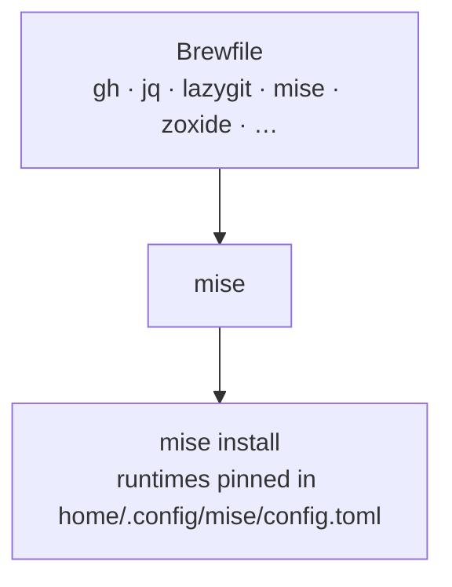

# dev-cli

Repo: [dotfiles](../../README.md) · The module contract:
[docs/modules.md](../../docs/modules.md)

Development CLI tools, plus the language runtimes they assume.

Two package managers, and the split is deliberate: **Homebrew owns CLIs, mise
owns runtimes.** A `brew`-installed runtime moves when Homebrew decides it
does; a mise-installed one moves when you edit a file.



## Why `apply.sh` exists

`mise activate` never installs anything. Linking `config.toml` alone leaves it
unread until someone runs `mise install` by hand, so this hook runs it.

## `doctor.sh` never invokes mise

`mise ls` **creates** `~/.local/share/mise` and `~/.local/state/mise` on a
machine that has neither — a check that writes to the `$HOME` it is checking.
So the hook reads the install tree directly instead:

```
~/.local/share/mise/installs/<tool>/  runtime present
```

`doctor.sh` reads the `[tools]` table out of the repo's own `config.toml`, so a
runtime added there is checked without editing the hook. `contract.bats`
enforces this with a `mise` stub on `PATH` that records any invocation — the
generic `$HOME` snapshot only fires on a machine that *has* mise, and CI has
none.

## The sign-ins a fresh machine still owes you

Installing `gh`, `gcloud` and `firebase` is one `dot apply`. Being able to
*use* them is three more commands, and nothing says so — the run finishes
green and the first 401 arrives an hour later. So `doctor.sh` reads
`data/signin.tsv` and reports each one:

| Column | |
|---|---|
| 1 | the command |
| 2 | the Brewfile package that provides it |
| 3 | the file that proves a login, under `$HOME` |
| 4 | the pattern that proves it — an ERE, matched against that file |
| 5 | the command that puts it there |
| 6 | what it costs — printed under the warning, and the reason to act on it |

It looks for the **credential store on disk** and never asks the tool.
`gcloud auth list` and `firebase login:list` create their config directory on a
machine that has none — a check writing to the `$HOME` it is checking, the same
trap `mise ls` sets above.

**A file is not a credential, and neither is a file with bytes in it.** That is
what column 4 is for: every one of these stores outlives the login that filled
it. `credentials.db` is still a SQLite database once its rows are revoked,
`firebase-tools.json` keeps its client id and usage counters after a logout,
and `gh` writes an empty `hosts.yml` the first time it merely *reads* a config.
A size test calls all three signed in. The pattern names what a login actually
writes, and `gcloud`'s row points at `configurations/config_default` rather
than the database precisely because `account = …` is a line a revoke clears and
a SQLite page is not.

A file is weaker evidence than a question, so the warning names the path it
looked at: a tool that moves its store — or renames what it writes into it —
would otherwise warn forever with nothing on screen to say why.

A row only speaks when `command -v` finds the tool, which is what keeps a
machine that wants no `gcloud` from staying yellow forever — drop the package
from the `Brewfile` and the row goes quiet. That is also why column 2 exists:
`contract.bats` holds it against the `Brewfile`, so a row here is a claim this
module installs the tool, and a CLI another module owns belongs in *that*
module's `doctor.sh`.

## Where mise's data directory comes from

Both `doctor.sh` and `remove.sh` rebuild mise's default data directory by hand
(`MISE_DATA_DIR`, else `XDG_DATA_HOME`, else `~/.local/share/mise`), because
mise does not expose it for scripting and it has to keep resolving once mise
itself is gone. A test holds the two lines identical.

## Removal deletes nothing

There is nothing safe to delete, and that is the point. `apply.sh` downloads
into a directory full of other projects' toolchains, so `remove.sh` reports
what is left rather than guessing which of it was ours:

| Left alone | Yours to run |
|---|---|
| `~/.local/share/mise` — language runtimes | `mise implode` |

Same trade as `macos-defaults`: no state file, so the warning *is* the
deliverable. It stays silent when the directory does not exist, because
`uninstall.sh` runs every module's `remove.sh` and a machine that never
enabled this one must hear nothing.
