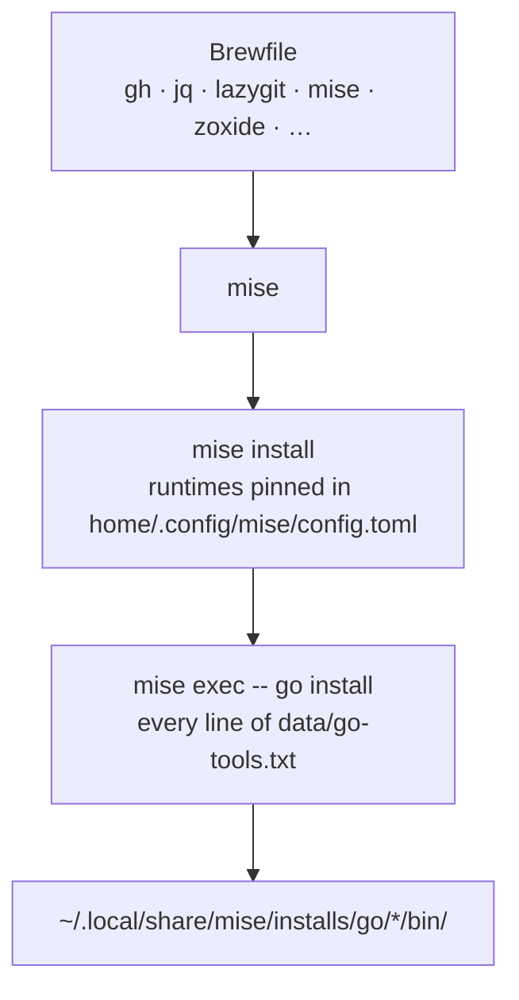

# dev-cli

Development CLI tools, plus the language runtimes and go tooling they assume.

Two package managers, and the split is deliberate: **Homebrew owns CLIs, mise
owns runtimes.** A `brew`-installed Go moves when Homebrew decides it does; a
mise-installed one moves when you edit a file.



## Why `apply.sh` exists

`mise activate` never installs anything. Linking `config.toml` alone leaves it
unread until someone runs `mise install` by hand, so this hook runs it.

Everything goes through `mise exec`, never a bare `go`. Activation is a zsh hook
(`modules/zsh/.zshrc`) and hooks run under bash with no shell rc, so `command -v
go` is false on the one machine this matters on — the fresh one. `mise exec --
go install` also sets `GOBIN` into mise's own install directory, so the binaries
land where an activated shell already looks.

## The go tools are data, not code

[`data/go-tools.txt`](data/go-tools.txt) is one `go install` argument per line —
`gopls`, `dlv`, `goimports`, `staticcheck`, the tools VS Code's Go extension
shells out to.

Two readers, one file: `apply.sh` installs every line, `doctor.sh` looks for the
binary named by each line's last path segment. Typed out in both, a tool added
to one would be a tool the other never looks for, and the gap is silent by
construction — a missing `gopls` is a VS Code with no IntelliSense and no error
anywhere. `tests/contract.bats` pins that both hooks read the file, and skip
comments, with the same expression.

Runtimes work the same way: `doctor.sh` reads the `[tools]` table out of the
repo's own `config.toml`, so a runtime added there is checked without editing
the hook.

## `doctor.sh` never invokes mise

`mise ls` **creates** `~/.local/share/mise` and `~/.local/state/mise` on a
machine that has neither — a check that writes to the `$HOME` it is checking.
So the hook reads the install tree directly instead:

```
~/.local/share/mise/installs/<tool>/          runtime present
~/.local/share/mise/installs/go/*/bin/<name>  go tool present
```

The glob spans a Go upgrade without naming a version. `contract.bats` enforces
this with a `mise` stub on `PATH` that records any invocation — the generic
`$HOME` snapshot only fires on a machine that *has* mise, and CI has none.

Both `doctor.sh` and `remove.sh` rebuild mise's default data directory by hand
(`MISE_DATA_DIR`, else `XDG_DATA_HOME`, else `~/.local/share/mise`), because
mise does not expose it for scripting and it has to keep resolving once mise
itself is gone. A test holds the two lines identical.

## Removal deletes nothing

There is nothing safe to delete, and that is the point. `apply.sh` downloads
into directories full of other projects' toolchains, so `remove.sh` reports what
is left rather than guessing which of it was ours:

| Left alone | Yours to run |
|---|---|
| `~/.local/share/mise` — runtimes and go tools | `mise implode` |
| `~/go/pkg/mod` — Go's module cache | `go clean -modcache` |

Same trade as `macos-defaults`: no state file, so the warning *is* the
deliverable. It stays silent when neither directory exists, because
`uninstall.sh` runs every module's `remove.sh` and a machine that never enabled
this one must hear nothing.
