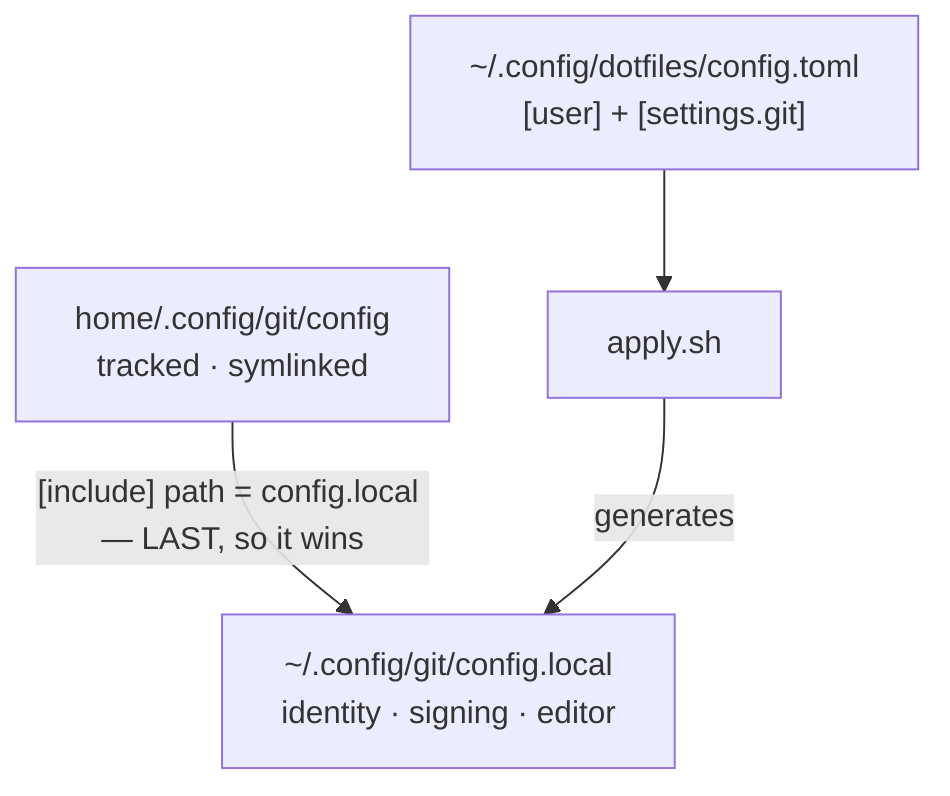

# git

Repo: [dotfiles](../../README.md) · The module contract:
[docs/modules.md](../../docs/modules.md)

Git configuration in two halves: a tracked file everyone gets, and a generated
one holding the values that vary by person and machine.



The include path is **relative on purpose**. Git resolves it against the file as
it found it — `~/.config/git/config`, the symlink — not against the repo it
resolves to. Make it absolute and it stops following the checkout.

`modules/ssh` does the reverse (`Include` *first*) because ssh takes the first
value it obtains for each keyword, and git takes the last.

## No templating

`config.local` is a few values `printf`'d into a file. There is no template
engine and there will not be one: if a generator ever needs a conditional, the
conditional belongs in git's own config language.

What lands in it:

| Section | When |
|---|---|
| `[user] name`, `email` | always — from `[user]` in `config.toml` |
| `signingkey`, `[gpg]`, `[gpg "ssh"]`, `[commit] gpgsign` | only when the key is set **and** 1Password's signer is on disk |
| `[core] editor` | only when VS Code is installed |

Both conditionals exist because the alternative fails silently and late. A
`core.editor` pointing at a binary that is not there makes every `git commit`
fail on a missing editor. The path is absolute because git run from a GUI
inherits no shell `PATH`.

## Commit signing: all three keys or none

Signing needs `gpg.format = ssh`, `gpg.ssh.program` and `commit.gpgsign = true`
together. Written without a reachable signer, `gpgsign = true` **aborts every
commit** on the machine.

So on a fresh Mac — where 1Password is a cask installing in the same run —
`apply.sh` leaves signing off and warns once. That warning scrolls past, and
every commit is then unsigned with nothing to notice, which is exactly what
`doctor.sh` is for: it keeps saying so on every `dot doctor` until a second
`dot apply` turns signing on.

The signer is 1Password's own binary, not ssh:

```
/Applications/1Password.app/Contents/MacOS/op-ssh-sign
```

**`modules/ssh` does not cover this.** Git shells out to `gpg.ssh.program`,
which defaults to `ssh-keygen -Y sign`, and `ssh-keygen` never reads
`~/.ssh/config`. Only 1Password's signer reaches the vault.

This module names the `1password` cask in its own Brewfile even though
`modules/ssh` names it too. Modules run alphabetically — `git` before `ssh` — so
naming it here is what makes `module_apply`'s one promise true: the signer
exists by the time `apply.sh` decides whether signing can be switched on. `brew
bundle` is idempotent, so the duplicate costs nothing.

## Removal

`config.local` is *written*, not linked, so the symlink sweep cannot see it.
`remove.sh` greps for the generated-by header before deleting — `config.local`
is a conventional name, and a hand-written one may well predate this module. If
the header is not there, the file is named and left alone.

## Settings

```toml
[user]
name  = "Your Name"
email = "you@example.com"

[settings.git]
signingkey = "ssh-ed25519 AAAA..."   # the PUBLIC half; omit to disable signing
```

`[user]` is the shared table, read with `cfg_get` — the one exception to a hook
reading only its own `[settings.<module>]` block, because identity is not
git-specific. Every value passing into the file is escaped first: `#` and `;`
start a comment in git's config language and a bare `"` is stripped, silently.
