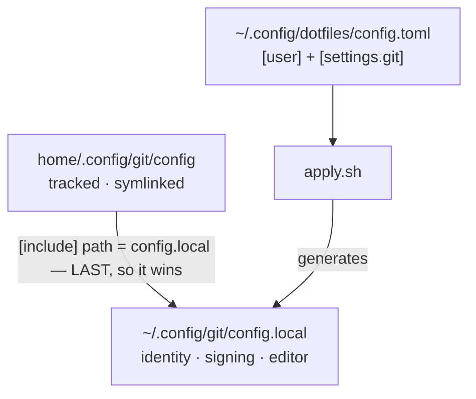

# git

Repo: [dotfiles](../../README.md) · The module contract:
[docs/modules.md](../../docs/modules.md)

Git configuration in two halves: a tracked file everyone gets, and a generated
one holding the values that vary by person and machine.



The include path is **relative on purpose**. Git resolves it against the file as
it found it — `~/.config/git/config`, the symlink — not against the repo it
resolves to. Make it absolute and it stops following the checkout.

`modules/ssh` does the reverse (`Include` *first*) because ssh takes the first
value it obtains for each keyword, and git takes the last.

## No templating

`config.local` is a few values `printf`'d into a file. There is no template
engine and there will not be one: if a generator ever needs a conditional, the
conditional belongs in git's own config language.

What lands in it:

| Section | When |
|---|---|
| `[user] name`, `email` | always — from `[user]` in `config.toml` |
| `signingkey`, `[gpg]`, `[gpg "ssh"]`, `[commit] gpgsign` | only when the key is set **and** 1Password's signer is on disk |
| `gpg.ssh.allowedSignersFile` | also only when the key is a *literal* public key |
| `[core] editor` | only when VS Code is installed |

Both conditionals exist because the alternative fails silently and late. A
`core.editor` pointing at a binary that is not there makes every `git commit`
fail on a missing editor. The path is absolute because git run from a GUI
inherits no shell `PATH`.

## Commit signing: all three keys or none

Signing needs `gpg.format = ssh`, `gpg.ssh.program` and `commit.gpgsign = true`
together. Written without a reachable signer, `gpgsign = true` **aborts every
commit** on the machine.

So on a fresh Mac — where 1Password is a cask installing in the same run —
`apply.sh` leaves signing off and warns once. That warning scrolls past, and
every commit is then unsigned with nothing to notice, which is exactly what
`doctor.sh` is for: it keeps saying so on every `dot doctor` until a second
`dot apply` turns signing on.

The signer is 1Password's own binary, not ssh:

```
/Applications/1Password.app/Contents/MacOS/op-ssh-sign
```

**`modules/ssh` does not cover this.** Git shells out to `gpg.ssh.program`,
which defaults to `ssh-keygen -Y sign`, and `ssh-keygen` never reads
`~/.ssh/config`. Only 1Password's signer reaches the vault.

This module names the `1password` cask in its own Brewfile even though
`modules/ssh` names it too. Modules run alphabetically — `git` before `ssh` — so
naming it here is what makes `module_apply`'s one promise true: the signer
exists by the time `apply.sh` decides whether signing can be switched on. `brew
bundle` is idempotent, so the duplicate costs nothing.

## Verifying is a second setting

Signing a commit and being able to check one are configured separately, and
having only the first is a half-configuration git reports in the most
misleading way available:

```
$ git log --show-signature -1
error: gpg.ssh.allowedSignersFile needs to be configured and exist
...
No signature
```

The commit *is* signed. `ssh-keygen` simply has no file saying which key counts
as yours, so it cannot say anything — and "No signature" is what a repo full of
signed commits then looks like.

So `apply.sh` writes a second file, `~/.config/git/allowed_signers`, holding
one line:

```
you@example.com ssh-ed25519 AAAA...
```

It is written only when signing itself was switched on — a file naming a key
nothing can sign with is no use — and only when `signingkey` holds a **literal
public key**. Git also accepts a *path* there, and a path copied into this file
produces something `ssh-keygen` refuses to read, which git reports as a failed
verification rather than as the bad config it is. That case warns and leaves
signing alone.

`tests/git.bats` signs a payload with a real key and verifies it against the
generated file, then does it again with a *different* key and requires that to
fail. An `allowed_signers` that accepts anything is worse than none, and a test
that only compares strings could not tell the two apart.

`doctor.sh` makes the **same** shape test, held against `apply.sh` by a test
that reads both literals out of the files. Without that they drift, and the
symptom is precise: doctor answers a key that is a path with "run `dot apply`",
`dot apply` refuses it on purpose, and the line stays yellow forever behind a
command that changes nothing.

What it looks for **in** the file is an active record, not the key as a
substring: a record is `<principals> [options] <keytype> <base64>`, and the
keytype and its base64 are matched as an adjacent pair of fields. `ssh-keygen`
ignores a commented or unparseable line, so a search that did not would call a
machine that cannot verify a single commit healthy — the key sitting in a
comment above the record that actually rotated it is the shape that does it.

The header is proof of ownership for `apply.sh` as much as for `remove.sh`: a
file already at this path **without** it belongs to whoever wrote it, so a run
says so and leaves every byte alone. `config.local` still points git at it —
reading a file someone else maintains costs nothing — and `doctor.sh` then
answers the only question that matters, whether it names the key you sign with.

Turning signing off again, or moving `signingkey` to a path after a run that
wrote a file, **removes** the stale `allowed_signers` — the header is the proof
it was ours. Nothing reads a file `config.local` no longer points at, so this
is tidiness rather than a fix; but *derive, never record* cuts both ways, and a
generated file the repo has stopped accounting for is one only `uninstall.sh`
would find again.

## Removal

Both generated files are *written*, not linked, so the symlink sweep cannot see
either. `remove.sh` greps for the generated-by header before deleting —
`config.local` and `allowed_signers` are both conventional names, and a
hand-written one may well predate this module. If the header is not there, the
file is named and left alone. One function greps both, so the literal that
proves ownership exists once; `tests/git.bats` reads it back out of that line
rather than keeping a third copy.

## Settings

```toml
[user]
name  = "Your Name"
email = "you@example.com"

[settings.git]
signingkey = "ssh-ed25519 AAAA..."   # the PUBLIC half; omit to disable signing
```

`[user]` is the shared table, read with `cfg_get` — the one exception to a hook
reading only its own `[settings.<module>]` block, because identity is not
git-specific. Every value passing into the file is escaped first: `#` and `;`
start a comment in git's config language and a bare `"` is stripped, silently.
