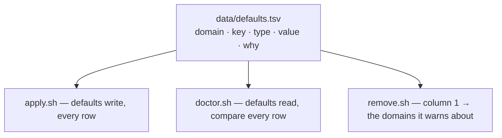

# macos-defaults

macOS system preferences — Dock, Finder, keyboard, text substitution,
screenshots. Imperative and idempotent; the only *tool* module that links no
files at all, because none of this is a file — it has no `home/`, and no
Brewfile either.

Nothing here needs root.

## One table, three readers



The writes are a data file, not shell literals, and that buys more than fewer
lines. A list a hook types out is a claim nothing checks, and the cost per line
is what makes a hook *sample* instead of check. Cut from the file, the list
cannot go stale and the sample becomes the whole table — so `doctor.sh` compares
every key, and `remove.sh` cannot name a domain `apply.sh` no longer writes.

`tests/contract.bats` pins all three to the same `data=` line, and separately
forbids `remove.sh` from naming a domain by hand.

Column 3 is the `defaults` type, so `apply.sh` writes with `-$type`. Both
readers have to undo it the same way, because `defaults read` prints a bool as
`1`/`0` and never as `true`/`false` — a test holds that mapping identical in the
two hooks.

## What is not in the table

A value that needs a config setting, or validation, stays in `apply.sh` where it
can be refused. The file holds only what a reader could not argue with.

| Setting | Default | Notes |
|---|---|---|
| `dock_autohide` | `true` | normalised to a literal `true`/`false` |
| `dock_tilesize` | `48` | must be a positive integer — `defaults -int` stores non-numeric as `0`, and tilesize `0` is a Dock with no icons |
| `screenshot_dir` | `Pictures/Screenshots` | relative to `$HOME` unless absolute; a leading `~` is expanded, not taken literally |

```toml
[settings.macos-defaults]
dock_autohide  = true
dock_tilesize  = 48
screenshot_dir = "Pictures/Screenshots"
```

A bad value is a `fail`, not a `die`: one wrong field must not cost the rest of
the run.

## Applying

Dock, Finder, SystemUIServer and WindowManager read their preferences at launch
only, so `apply.sh` restarts them. `NSGlobalDomain` cannot be restarted —
keyboard and text-substitution changes need a **log out and back in**, which
both the dry run and the real run say in the same words.

That line is `dim`, not `warn`. It is true of every run that reaches it, and as
a warning it would exit `DOT_STATUS_WARN` every time and `dot apply` could never
reach "Done".

`doctor.sh` warns rather than fails on drift: an OS update or a Settings pane
reverting a key is not a broken install. But it is otherwise invisible — the
only symptom is a Mac that behaves slightly wrong — which is why every row is
checked.

## This module cannot be undone

`apply.sh` never read the old values, so they exist nowhere. `defaults delete`
would give you Apple's factory setting, not what you had. Making it reversible
means recording state at apply time, and this repo derives rather than records.

So `remove.sh` deletes nothing. It prints the domains that were written to and
says plainly that they cannot be put back — and only when at least one row of
the table is **still in force**, because `uninstall.sh` runs every module's
`remove.sh`, enabled or not, and a machine that never turned this one on must
not be told its preferences were changed.

Putting a value back is manual, in System Settings or with `defaults write`. The
domains are listed for you; the values from before are gone.
