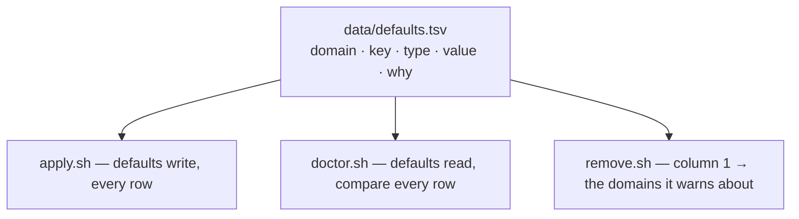

# macos-defaults

Repo: [dotfiles](../../README.md) · The module contract:
[docs/modules.md](../../docs/modules.md)

macOS system preferences — Dock, Finder, trackpad, keyboard, text substitution,
screenshots, and the locale units. Imperative and idempotent, and the only
*tool* module that links no files at all: none of this is a file, so it has no
`home/` and no Brewfile either.

Nothing here needs root.

## One table, three readers



The writes are a data file, not shell literals, and that buys more than fewer
lines. A list a hook types out is a claim nothing checks, and the cost per line
is what makes a hook *sample* instead of check. Cut from the file, the list
cannot go stale and the sample becomes the whole table — so `doctor.sh` compares
every key, and `remove.sh` cannot name a domain `apply.sh` no longer writes.

`tests/contract.bats` pins all three to the same `data=` line, and separately
forbids `remove.sh` from naming a domain by hand.

### Units are written, not inherited

The locale rows — 24-hour clock, metric, Celsius — are values macOS would
otherwise derive from the region the installer was answered with. On a machine
set up as Norwegian they change nothing; writing them anyway is what makes the
answer a property of *this repo* rather than of an installer dialog nobody
remembers. That is the same reason every other row is here: a preference that
depends on how the machine was set up is one a rebuild can get wrong.

Column 3 is the `defaults` type, so `apply.sh` writes with `-$type`. Both
readers have to undo it the same way, because `defaults read` prints a bool as
`1`/`0` and never as `true`/`false` — a test holds that mapping identical in the
two hooks.

## What is not in the table

A value that needs a config setting, or validation, stays in `apply.sh` where it
can be refused. The file holds only what a reader could not argue with.

| Setting | Default | Notes |
|---|---|---|
| `dock_autohide` | `true` | normalised to a literal `true`/`false` |
| `dock_tilesize` | `48` | must be a positive integer — `defaults -int` stores non-numeric as `0`, and tilesize `0` is a Dock with no icons |
| `screenshot_dir` | `Pictures/Screenshots` | relative to `$HOME` unless absolute; a leading `~` is expanded, not taken literally |
| `touch_id_sudo` | `true` | not written at all — only *checked*; see below |

```toml
[settings.macos-defaults]
dock_autohide  = true
dock_tilesize  = 48
screenshot_dir = "Pictures/Screenshots"
touch_id_sudo  = true
```

A bad value is a `fail`, not a `die`: one wrong field must not cost the rest of
the run.

## Applying

Dock, Finder, SystemUIServer and WindowManager read their preferences at launch
only, so `apply.sh` restarts them. `NSGlobalDomain` cannot be restarted —
keyboard and text-substitution changes need a **log out and back in**, which
both the dry run and the real run say in the same words.

That line is `dim`, not `warn`. It is true of every run that reaches it, and as
a warning it would exit `DOT_STATUS_WARN` every time and `dot apply` could never
reach "Done".

`doctor.sh` warns rather than fails on drift: an OS update or a Settings pane
reverting a key is not a broken install. But it is otherwise invisible — the
only symptom is a Mac that behaves slightly wrong — which is why every row is
checked.

## Three things it reports and cannot write

FileVault, the application firewall and Touch ID for `sudo` are not `defaults`
keys. Each needs root to change and two need a GUI, so `apply.sh` cannot write
them — and they are deliberately **not** in `data/defaults.tsv`, which is the
list of what this module writes and what `remove.sh` derives its domains from.
A row there would make `apply.sh` run `defaults write` against something that
is not a preference at all.

`doctor.sh` reports them anyway, because this is the module for macOS system
state and a Mac with the firewall off is otherwise something nothing in this
repo ever looks at. Reading all three needs no root and no unlock:

| Checked with | Green when |
|---|---|
| `fdesetup status` | `FileVault is On.` |
| `socketfilterfw --getglobalstate` | `State = 1` or `2` — 2 is on *and* blocking all incoming |
| `/etc/pam.d/sudo_local` | it holds an **uncommented** `pam_tid.so` auth line |

The last one is the subtle one. macOS ships `sudo_local.template` with the
`pam_tid` line commented out, so copying the template and changing nothing is
the most likely half-done state there is — and a check for the file alone would
call it finished.

Touch ID is also the only one of the three with a setting. FileVault and the
firewall are baselines; wanting `sudo` to keep asking for a password is a
taste, and without `touch_id_sudo = false` a machine that holds it would stay
yellow forever — which says exactly as little as a machine that is always
green.

A tool that answers nothing is a **warning**, never silence: a question that
could not be asked is not a healthy answer, the same three-state rule
`brew_missing` exists to keep.

Both paths are inputs — `DOT_SOCKETFILTERFW` and `DOT_SUDO_LOCAL` — because
otherwise the branch a test needs is the one the machine running it never
takes.

## This module cannot be undone

`apply.sh` never read the old values, so they exist nowhere. `defaults delete`
would give you Apple's factory setting, not what you had. Making it reversible
means recording state at apply time, and this repo derives rather than records.

So `remove.sh` deletes nothing. It prints the domains that were written to and
says plainly that they cannot be put back — and only when at least one row of
the table is **still in force**, because `uninstall.sh` runs every module's
`remove.sh`, enabled or not, and a machine that never turned this one on must
not be told its preferences were changed.

Putting a value back is manual, in System Settings or with `defaults write`. The
domains are listed for you; the values from before are gone.
