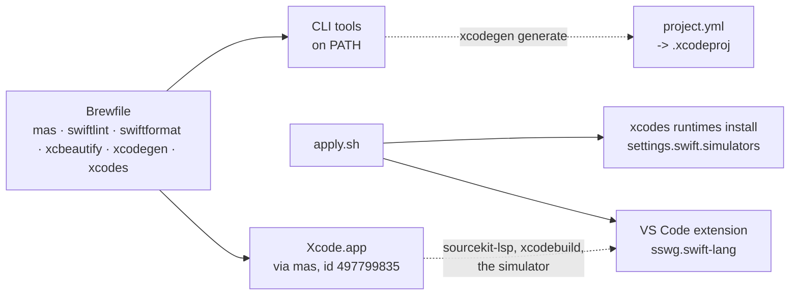

# swift

Repo: [dotfiles](../../README.md) · The module contract:
[docs/modules.md](../../docs/modules.md)

Swift and iOS development from VS Code, without living in Xcode's editor.
Xcode itself still has to be on disk — its SDKs, simulators and codesigning are
not distributed any other way — but nothing here opens its window.



## Three things this cannot automate

Each needs an interactive prompt or `sudo`, so each stays a one-time step on a
new machine — `dot doctor` names the exact command for the two it can check.

1. **Sign into the App Store first.** `mas` has had no way to sign in
   non-interactively since Apple put sign-in behind 2FA. Without this, the
   `mas "Xcode"` line in the Brewfile fails and `dot apply` reports it —
   `swiftlint`, `swiftformat` and `xcbeautify` still install; only the VS Code
   extension waits, because `apply.sh` only runs once its module's *whole*
   Brewfile installs clean (the same rule `dev-cli` runs on for `mise`). Sign
   in, then `dot apply` again.
2. **Point the toolchain at Xcode, not the Command Line Tools:**
   `sudo xcode-select -s /Applications/Xcode.app/Contents/Developer`.
3. **Accept the licence:** `sudo xcodebuild -license accept`, or open
   Xcode.app once.

## What actually runs in VS Code

Once the three steps above are done:

- The **Swift** extension (`sswg.swift-lang`) drives `sourcekit-lsp` for
  autocomplete, diagnostics and go-to-definition, and can build, run and debug
  against the iOS simulator directly — no Xcode window involved.
- Pure Swift Package Manager projects (libraries, CLIs) need nothing from
  Xcode's editor at all.
- `xcodebuild`/`xcrun simctl` from the integrated terminal build, run and
  archive the same way Xcode's own toolbar buttons do; `xcbeautify` pipes their
  output into something readable.
- Storyboards and XIBs still need Interface Builder — a reason to leave a
  SwiftUI-only project as one.
- SwiftUI's canvas preview is Xcode-only, with no VS Code equivalent. Building
  and running on the simulator from the terminal is the substitute.

## Project config: XcodeGen instead of `.xcodeproj`

`project.pbxproj` is a plist Xcode generates and rewrites on every change in
its UI — hand-editing it is how two people touch the same project and get a
conflict neither can resolve by reading it. [XcodeGen](https://github.com/yonaskolb/XcodeGen)
turns that around: describe targets, schemes and build settings in a
`project.yml` that is just text, then generate the project from it.

```yaml
# project.yml, in the app's own repo -- not this one.
name: MyApp
options:
  bundleIdPrefix: com.example
targets:
  MyApp:
    type: application
    platform: iOS
    sources: [Sources]
```

```sh
xcodegen generate   # writes MyApp.xcodeproj -- .gitignore it, keep project.yml
```

A pure Swift Package (`Package.swift`) needs none of this: it has no
`.xcodeproj` to generate in the first place. XcodeGen is for the day the
project is an iOS *app* rather than a library.

## Simulator runtimes

```toml
[settings.swift]
simulators = ["iOS 17.4", "iOS 16.4"]
```

| Setting | Default | Notes |
|---|---|---|
| `simulators` | `[]` | names as `xcrun simctl list runtimes` prints them |

Nothing downloads unless it is named here: each runtime is a multi-gigabyte
Apple asset, not something to fetch on every `dot apply`. Missing ones are
installed with [`xcodes`](https://github.com/XcodesOrg/xcodes) `runtimes
install`, not `xcodebuild -downloadPlatform` — the latter only ever offers
what is current for the installed Xcode, so an older simulator needs the
third-party tool's own catalog instead. This repo has not run either command
against a real Xcode install yet, so the exact syntax and its behaviour are
unverified and may need adjusting once it has; a failed install is a `warn`
naming the retry command, never a `fail`.

Both hooks skip the check entirely — `dim`, not silent — until Xcode, not the
Command Line Tools, is the selected developer directory: see
["Three things this cannot automate"](#three-things-this-cannot-automate).

## `doctor.sh`

Reads state, writes nothing:

| Check | How |
|---|---|
| Xcode installed | `-d /Applications/Xcode.app` |
| Selected | `xcode-select -p` equals Xcode's `Contents/Developer` |
| Licence accepted | `defaults read` compares the agreed and installed versions |
| VS Code extension | the extensions folder, not `code --list-extensions` |
| Simulator runtimes | `xcrun simctl list runtimes`, one row per configured entry |

The extension check reads `~/.vscode/extensions/` directly rather than running
`code --list-extensions`, which **creates** `~/.vscode` and
`~/Library/Application Support/Code` on a machine that has neither — the same
trap `colima status` (`containers`) and `mise ls` (`dev-cli`) set for a
`doctor.sh` that has to stay read-only.

## Removal

Xcode, `mas` and the CLI tools are Homebrew/mas packages: they stay, same as
every other module's (see [Configuration](../../docs/configuration.md#enabling-and-disabling),
"packages stay"). The VS Code extension is the one thing `apply.sh` puts
somewhere the uninstall sweep cannot see, and it is still not `remove.sh`'s to
delete unasked — it reports the extension and the one command that removes it.
