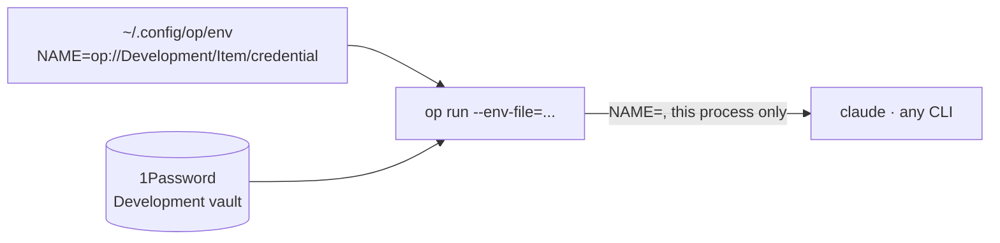

# zsh

Repo: [dotfiles](../../README.md) · The module contract:
[docs/modules.md](../../docs/modules.md)

The shell: XDG layout, aliases, PATH, prompt. This page covers the one part that
is not obvious from the files, how API keys reach a command.

## API keys

Keys live in 1Password, never in this repo and never in a shell startup file.
`home/.config/op/env` lists **references** to them, and `op run` swaps each
reference for its value in the environment of one child process:



```sh
op run --env-file="$HOME/.config/op/env" -- claude
```

The value exists in that process and its children, nowhere else: not in `env`
of the parent shell, not in a file, not in history.

### Adding a key

1. In the 1Password app, create an item in the **Development** vault: category
   *API Credential*, a title with no spaces (`Context7`), the key in the
   `credential` field. The app, not `op item create credential=...`, which puts
   the key in shell history and the process list.
2. Check it resolves, without printing it: `op read "op://Development/Context7/credential" | wc -c`
3. Add one line to `home/.config/op/env`, the variable name being what the tool
   reads:

   ```
   CONTEXT7_API_KEY=op://Development/Context7/credential
   ```

One item per service, so a key can be rotated or shared on its own.

### The rules, and why

- **Every line must resolve.** One reference to a missing item makes `op run`
  abort before the command starts, so a line is added only once its item exists.
- **References only.** `contract.bats` fails on any line that is not
  `NAME=op://...`, so a pasted key cannot be committed by accident. What the
  file does reveal is the vault, item and field names.
- **No `export X="$(op read ...)"` in `.zshrc`.** That is a 1Password prompt on
  every shell start, and the key lands in the environment of every process the
  shell ever launches.
- **`ANTHROPIC_API_KEY` stays out.** With it set, Claude Code bills the API
  instead of using the subscription login.

### Prerequisites

`op` comes from the `1password-cli` cask in `modules/ssh/Brewfile`. It reads
the vault through the app once **1Password → Settings → Developer → Integrate
with 1Password CLI** is ticked; Touch ID then unlocks it. `op vault list` proves
the link.
